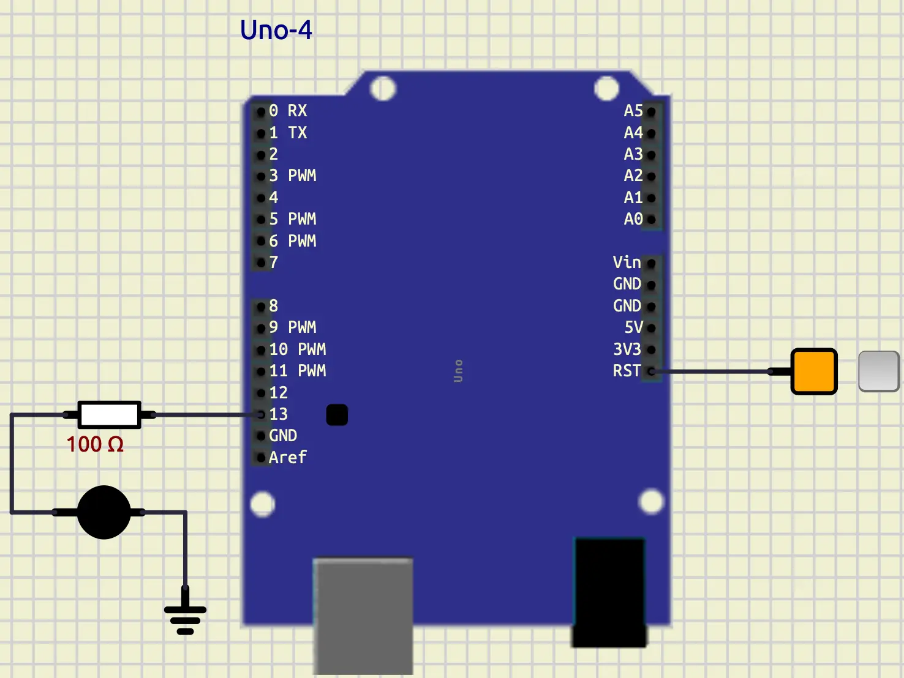

# Introduction

## Why should we use Arduino

**Arduino** is one of the greatest and easiest ways to start working with electronics.
It has a large and supportive community with tons of examples and projects.
It has been a go-to for most of the hobbyists, and it has so many use cases at an industrial level.
We can do so many fascinating projects with it, from beginner to advanced levels.
To name a few, we can start with a simple **Blink LED Project**, and **Traffic light controller**.
For more intermediate projects, we can mention:

- **Smart Plant Watering system**: Check the moisture and pump the water.
- **Automatic Night Lamp**: Use a light sensor to turn on the light when it's dark.
- **Distance measurement**: Use a distance measurement sensor and report the output.

If we want to be more advanced, we can mention:

- **Robotics**: Controlling motors, sensors, etc., and getting commands from other sources.
- **Home Automation**: Control lights, fans, and connect them to apps.
- **Weather station**: Check various sensors like (temperature, humidity, e.t.c) and log it.
- **IOT projects**: Use WI-FI modules to send the sensor outputs to the cloud.
- **Wearables**: Smartwatches, fitness trackers, etc.

## What is Arduino

Now we know what can be done with **Arduino**, it is time to understand it better.
**Arduino** is an Open-source electronics platform.
It consists of both easy-to-use hardware (like **Uno**, **Nano**, **Mega**, etc.) and software (Arduino IDE).
It is known as one of the best tools for learning electronics.


In the image above, you can see an **Arduino UNO** board,
which is the main focus of this tutorial.
As you can see, on the **Arduino UNO's board**, we have a microcontroller.
This microcontroller is an **AVR microcontroller**, called **ATMEGA328P**.
**Arduino** has made a really great and super-easy-to-use framework for
**AVR Microcontrollers** that we are going to use mostly in this tutorial.
At the top of this image, you can see there are **13 pins** that we can use
for input and output.
These pins are called **General-Purpose input/output** (**GPIO**).

## Blinking LED

Let's start with a simple project as a **Hello World**.
The goal of this project is to connect an **LED** to an **Arduino UNO** in our simulation and make it blink
with a certain frequency.

### Put an LED on the Board

At first, let's light up an **LED** in **SimulIDE**.
To do so, we can follow these steps:

- Open up **SimulIDE**.
- In the left panel, drag an **LED** (Outputs/Leds/LED) and put it on the board.
- In the left panel, drag a **Fixed Voltage** (Sources/Fixed voltage) and put it on the board.
- In the left panel, drag a **Ground** (Sources/Ground) and put it on the board.
- Connect the **Fixed Voltage** to the **anode** of **LED** (the longest pin).
- Connect the **Ground** to the **cathode** of **LED** (the shortest pin).
- Click on the **Fixed Voltage** to turn it on.
- Press **Start simulation** in the top panel.

You should have an output like below:


In the image above, we have an **LED** that we can control the state of it
using the button on the **Fixed Voltage**.

### Connect LED to Arduino

Now, let's put an **Arduino Uno** on the board and control the state of
**LED** by that.
To do so, we can follow these steps:

- In the left panel, drag an **Arduino UNO** (Micro/Arduino/Uno) and put it on the board.
- Disconnect the **Fixed voltage** from the anode of the **LED** and connect it to **RST**.
- Let the **Fixed voltage** to be on.
- Connect the anode of the **LED** to the **pin 13**.

You should have something like this:



### Create a PlatformIO project

Now, let's create a **PlatformIO project** to be able to program our
**Arduino**.
To create a new project, you can follow these steps:

- Open **VS Code**
- Click on **PlatformIO** on the left panel
- Click on **New project**, A window opens up for you with the title of project wizard
- In the name section, enter the name of your project
- In the **Board** section select **Arduino Uno**
- In the **Framework** section select **Arduino**
- Click on the **Finish button**.


Now you have a project.
In the `src` directory, you have a file called `main.cpp`.
This file is the file that we are going to write our code in.
In this file, you have content like below:

```cpp
#include <Arduino.h>

// put function declarations here:
int myFunction(int, int);

void setup() {
  // put your setup code here, to run once:
  int result = myFunction(2, 3);
}

void loop() {
  // put your main code here, to run repeatedly:
}

// put function definitions here:
int myFunction(int x, int y) {
  return x + y;
}
```

We only need `setup` and `loop` functions, so we are going to remove the rest
of it to have a code like below:

```cpp
#include <Arduino.h>

void setup()
{
}

void loop()
{
}
```

`setup` only runs at the start of our program for one time.
It is like an initialization.
`loop` works like a `while true`.
It's always running, and we are going to put the logic of our program on it.

### Write the code for the blinking LED

Now, we are ready to write our code.
First thing that we should do is to set the **pin mode** of **pin 13**,
to output.
To do so, we can use the code below:

```cpp
pinMode(13, OUTPUT);
```

This code should be run only once at the start of our program.
So, we should put it in the setup.
Now, let's write the blinking process.
To do that, we can use a function called `digitalWrite`.
It takes a **pin** and a **Value**.
So, if we write `digitalWrite(13, HIGH)`, it would turn on the **LED**,
and if we write `digitalWrite(13, LOW)`, it would turn the **LED** off.
Let's put some `delay` between them, and we have a code like below:

```cpp
digitalWrite(13, HIGH);
delay(500);
digitalWrite(13, LOW);
delay(500);
```

As you can see, the code above is the logic of our program,
So, we should put that on the `loop` function.
As a result, our complete code would look something like this:

```cpp
#include <Arduino.h>

void setup()
{
  pinMode(13, OUTPUT);
}

void loop()
{
  digitalWrite(13, HIGH);
  delay(500);
  digitalWrite(13, LOW);
  delay(500);
}
```

### Build and upload firmware

Now, let's build our project and see the result on our simulation.
To build our **PlatformIO** project, we can use the **tick** button on the **top right** or **bottom left** of
**VS Code**.
When it is built successfully, there would be a `firmware.hex` file in `.pio/build/uno/`.
We need that file to upload to our simulation.
To do so, we can follow these steps:

- Go to the **SimulIDE**.
- Right-click on `Arduino Uno`.
- In `mega328`, click on load firmware.
- Select the path to the `firmware` that you have built previously (You might need to show hidden files).
- Press start simulation.

You should have an output like below:


## Conclusion

In this tutorial, we have introduced **Arduino**.
Then we built a **Hello World** project that showcases how we can make
a **Blinking LED**.
In the future, we are going to learn more about **GPIO**, and we do
more complicated projects together.