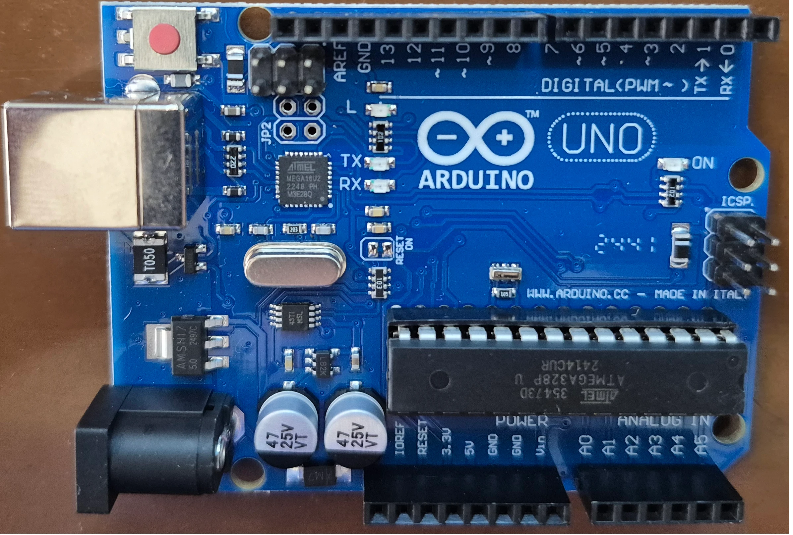

# Introduction

## Why should we use Arduino

**Arduino** is one of the greatest and easiest ways to start working with electronics.
It has a large and supportive community with tons of examples and projects.
It has been a go-to for most of the hobbyists, and it has so many use cases at an industrial level.
We can do so many fascinating projects with it, from beginner to advanced levels.
To name a few, we can start with a simple **Blink LED Project**, and **Traffic light controller**.
For more intermediate projects, we can mention:

- **Smart Plant Watering system**: Check the moisture and pump the water.
- **Automatic Night Lamp**: Use a light sensor to turn on the light when it's dark.
- **Distance measurement**: Use a distance measurement sensor and report the output.

If we want to be more advanced, we can mention:

- **Robotics**: Controlling motors, sensors, etc., and getting commands from other sources.
- **Home Automation**: Control lights, fans, and connect them to apps.
- **Weather station**: Check various sensors like (temperature, humidity, e.t.c) and log it.
- **IOT projects**: Use WI-FI modules to send the sensor outputs to the cloud.
- **Wearables**: Smartwatches, fitness trackers, etc.

## What is Arduino

Now we know what can be done with **Arduino**, it is time to understand it better.
**Arduino** is an Open-source electronics platform.
It consists of both easy-to-use hardware (like **Uno**, **Nano**, **Mega**, etc.) and software (Arduino IDE).
It is known as one of the best tools for learning electronics.

In the image above, you can see an **Arduino UNO** board,
Which is the main focus of this tutorial.

