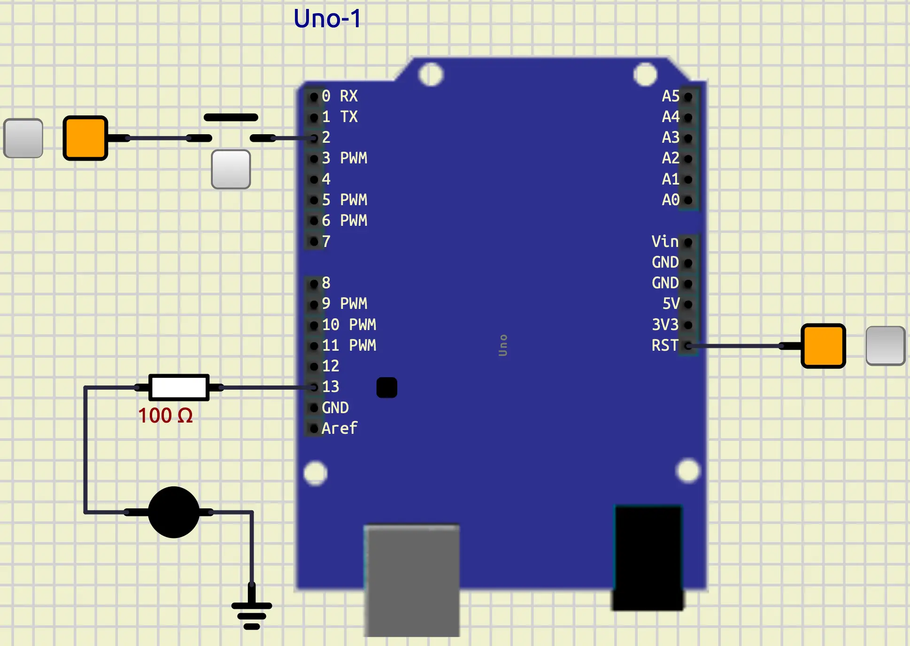
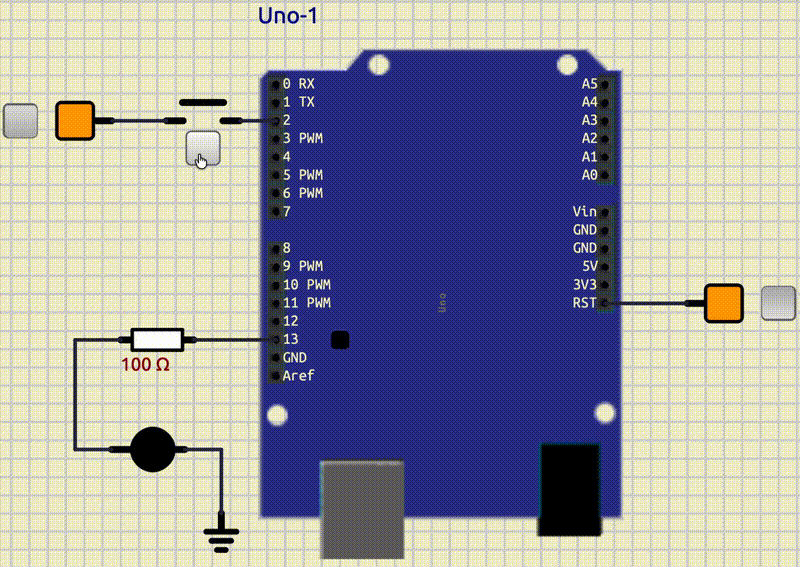

# GPIO

## Introduction

In the previous tutorial, we learned about the basics of **Arduino**.
We implemented a simple **Blink LED** project as a **Hello World**.
In this tutorial, we are learning more about **General-Purpose Input/Output** pins in **Arduino**.

## What is GPIO?

**GPIO** stands for **General-purpose Input/Output**.
There are pins in **Arduino** that we can determine if they should be input or output using code.

* Input pin: We **read** data from it.
* Output pin: We **write** data to it.

There are **14 Digital GPIO pins** and **6 Analog GPIO pins**.  
In the image below, we have highlighted **Digital GPIO pins** with red,
and **Analog GPIO pins** with yellow.


To change the mode of a pin in code, we can use the function below:

```cpp
pinMode(pin_number, mode);
```

* `pin_number`: number of the pin that we want to change (e.g., 13)
* `mode`: we can choose the mode of the pin; two of the choices are:
    * `INPUT`: 0
    * `OUTPUT`: 1

In the previous tutorial, we set the mode of **pin 13** to output, with the code below:

```cpp
pinMode(13, OUTPUT);
```

If we want to change the mode of **pin 3** to input, we can write a code like below:

```cpp
pinMode(3, INPUT);
```

## LED and key

Now, let's do a project that turns on an LED whenever we press a key.

### Connect an LED and a key to an Arduino

First, let's open up **SimulIDE**.
Then we can follow these steps to connect an LED and a key to an **Arduino Uno**:

* Put an **Arduino Uno** on the board.
* Put a **fixed voltage** on the board.
* Connect the **fixed voltage** to the reset pin of the **Arduino Uno** and let it be **on**.
* Put an **LED** on the board.
* Connect the **anode** (tallest pin) of the **LED** to the **pin 13** of **Arduino Uno**.
* Put a **ground** on the board.
* Connect the **cathode** (shortest pin) of the **LED** to the **ground**.
* Put a **button** (Switches/push) on the board.
* Put another **fixed voltage** on the board.
* Connect one pin of the **button** to the **fixed voltage**.
* Connect the other pin to the **pin 2** of **Arduino**.

After the steps above, you should have something like this:



With this setup, we have **pin 13** as an **output pin** and **pin 2** as an **input pin**.

### Write the code

Now, let's write the code that turns the LED on and off anytime we press it.
At first, we should set the mode of **pin 13** to **output**.

```cpp
pinMode(13, OUTPUT);
```

Next, we should set the mode of **pin 2** to **input**.

```cpp
pinMode(2, INPUT);
```

These codes are for initialization, so we should put them in `setup()` function.
Now, let's get ready to write our logic.
We need two variables:

- `led_state`: keeps the state of the LED (on/off).
- `button_pressed`: becomes `true` if the button is pressed.

So, let's define those variables as global variables. (below the includes)

```cpp
bool led_state = false;
bool button_pressed = false;
```

Our logic is:

- Check if the button is pressed
- If it was pressed:
    - Change the `led_state`.
    - Write the `led_state` to output.


So, let's write it down.

```cpp
button_pressed = digitalRead(2);
if (button_pressed)
{
    led_state = !led_state;
    digitalWrite(13, led_state);
    delay(500);
}
```

In the code above, we follow the logic that we have explained.
The reason that we put `delay(500)` is simple.
When we press the key down and release it, it takes about `200ms`.
In this `200ms`, `button_pressed` is `true`, so our code in the `if` statement would be executed many times.
To avoid this from happening, we put a `delay(500)`.
You can see the full code here:

```cpp
#include <Arduino.h>

bool led_state = false;
bool button_pressed = false;

void setup()
{
  pinMode(13, OUTPUT);
  pinMode(2, INPUT);
}

void loop()
{
  button_pressed = digitalRead(2);
  if (button_pressed)
  {
    led_state = !led_state;
    digitalWrite(13, led_state);
    delay(500);
  }
}
```

The output would be something like below:



## Control three LEDs

Now we know how to set a pin as an input and output.
Let's add more LEDs to the board and change our program in a way that whenever we press the button,
the LED that is turned on switches.
Also, in our simulation, we can control the color of the LEDs.
Let's change their colors to **red**, **yellow**, and **green**, like a stoplight.
You are free to connect the LEDs to whichever pin you want.
Your output should be something like this:


