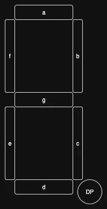
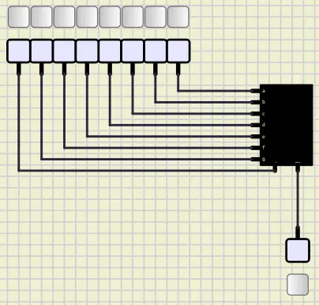
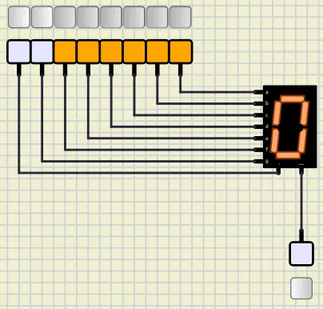

# GPIO Digital 2

## Introduction

In the previous tutorial, we learned about **GPIO**.
We managed to work with LEDs and buttons.
In this tutorial, we are going to work with **7-segments** and **keypads**.

## 7segment

A 7-segment is a set of 7 LEDs that can be used to show numbers and some letters.
Each LED is called a segment.
The segments are named from **a** to **g**.
Some 7-segments have a dot that is called **dp** (dot point).

We can find a **7-segment** in output/LEDs/7 Segment.

## Numbers on 7segment

At first, let's put a 7-segment on the board (output/LEDs/7 Segment)
and connect all of its pins to fixed voltages like below:

In the image above, we have connected all the pins of the 7-segment to the fixed voltages.
In order for the 7-segment to work, we should let the `-` pin have a low value.

Now we can make numbers by turning on and off the segments.
For example, if we want to make the number `0`, we should turn on all the segments except `g` and `dp`.
(Make sure that you are in a simulation mode.)
We are having something like this:

Now we can make all the numbers and store them in the format below:

| dp | g | f | e | d | c | b | a |
|----|---|---|---|---|---|---|---|
| 0  | 0 | 1 | 1 | 1 | 1 | 1 | 1 |
