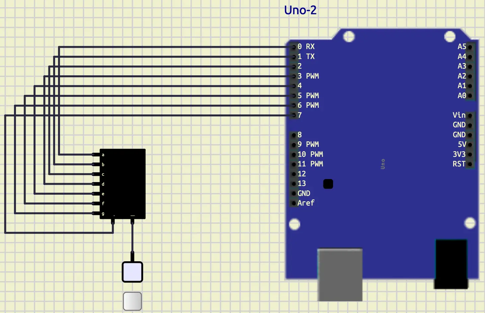
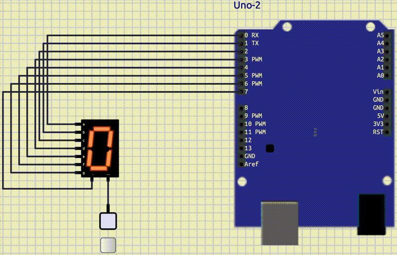
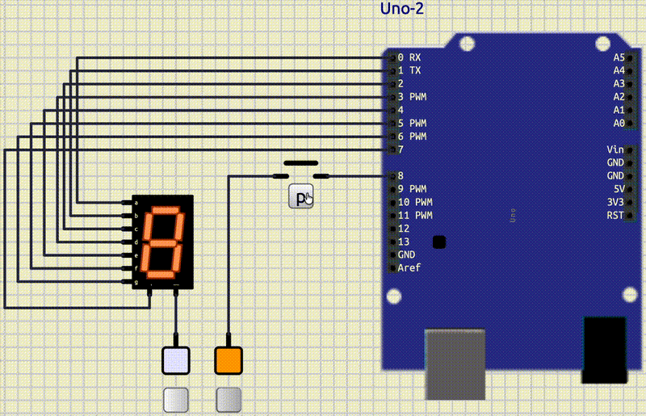
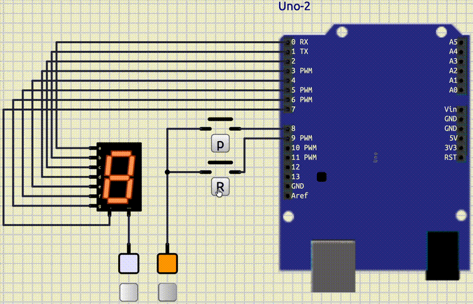

# GPIO Digital 2

## Introduction

In the previous tutorial, we learned about **GPIO**.
We managed to work with LEDs and buttons.
In this tutorial, we are going to work with **7-segment**.

## 7segment

A 7-segment is a set of 7 LEDs that can be used to show numbers and some letters.
Each LED is called a segment.
The segments are named from **a** to **g**.
Some 7-segments have a dot that is called **dp** (dot point).


We can find a **7-segment** in output/LEDs/7 Segment.

## Numbers on 7segment

At first, let's put a 7-segment on the board (output/LEDs/7 Segment)
and connect all of its pins to fixed voltages like below:


In the image above, we have connected all the pins of the 7-segment to the fixed voltages.
In order for the 7-segment to work, we should let the `-` pin have a low value.

Now we can make numbers by turning on and off the segments.
For example, if we want to make the number `0`, we should turn on all the segments except `g` and `dp`.
(Make sure that you are in a simulation mode.)
We are having something like this:


Now we can make all the numbers and store them in the format below:

| dp | g | f | e | d | c | b | a |
|----|---|---|---|---|---|---|---|
| 0  | 0 | 1 | 1 | 1 | 1 | 1 | 1 |

## Connect a 7segment to an Arduino

Now, let's add our **7-segment** to an **Arduino**.
To do that, we can follow these steps:

- Put an **Arduino Uno** on the board.
- Connect the 8 LED pins of the **7-segment** (**a** to **g** and **dp**) to **0-7** pins of **Arduino**.

You should have something like this:



## Write a counter

Now that we have all the numbers calculated, let's put them in a global array like below:

```cpp
char digits[10] = {
    0b00111111, // 0
    ...
};
```

After doing that, let's write a function that can be used to display those digits.

```cpp
void show_digit(int digit)
{
  for (int i = 0; i < 8; i++)
  {
    digitalWrite(i, (digits[digit] >> i) & 0b0000'0001);
  }
}
```

In the code above, we have a function called `show_digit` which takes a `digit` as its argument and
uses `digits` (the global array that we have calculated) and the `digitalWrite` function to write them in the respective
pin.
We have connected our **7-segment** to pins from **0** to **7**, so we should write in those pins.
To find out what we should write on them, we can explain it with an example.
Imagine that you want to write `0b0110'0101` on these pins.
You should write something like this:

| pin 7 | pin 6 | pin 5 | pin 4 | pin 3 | pin 2 | pin 1 | pin 0 |
|-------|-------|-------|-------|-------|-------|-------|-------|
| 0     | 1     | 1     | 0     | 0     | 1     | 0     | 1     |

So, if we shift `0b0110'0101` by `0`, we have: `0b0110'0101`.
If we and it with `0b0000'0001` we would have: `0b0000'0001`. 
That was the result for `pin 0` that we wanted.
Now, let's do it for `pin 1` as well.
We are going to shift `0b0110'0101` by `1`, so the result would be: `0b0011'0010`.
Next, we and it with `0b0000'0001`, we are going to have: `0b0000'0000`.
As you can see, we can do that for all the pins and write the value of the pin on it.
The process for **pin i** would be like below: 

* Shift the value by `i` 
* And it with `0b0000'0001`

Now that we have a function to write any digit that we want on the **7-segment**, you are able to write a counter.
Your output should look something like this:



## Button to pause the counting

We want you to add a button to pause the counting.
When we hold that button, the number on the **7-segment** should be frozen,
and when we release it, it should start counting again from that number.
Your output should be something like this:



> As you might have noticed, we should use **pressing** instead of **clicking**.
> The reason for that is that counting and clicking can't work simultaneously.
> If we want to rely on only one click, we might miss it.
> We are going to fix that when we explain about interrupts.

## Button to reverse the counting

We want you to add a button to reverse the counting.
When we hold that button, the numbers should go up, instead of down.
When we release it, it would do the counting normally, as it would.
Your output should be like this:



