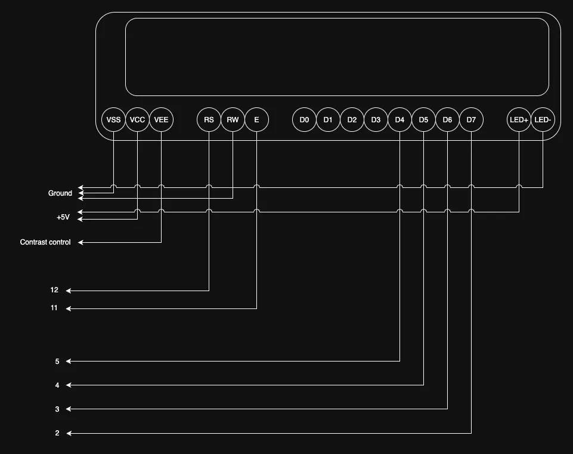
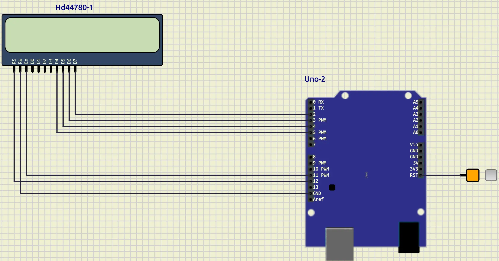
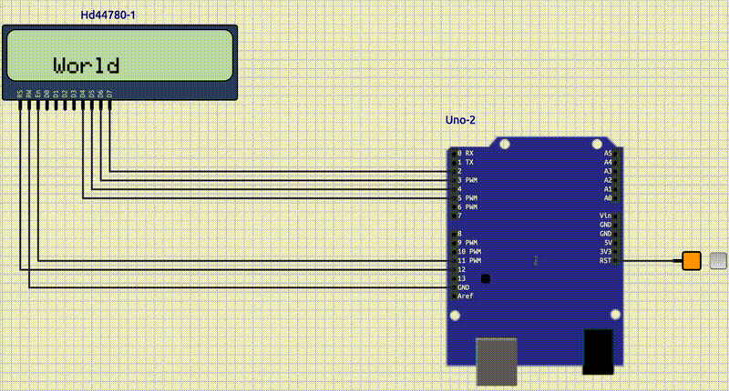
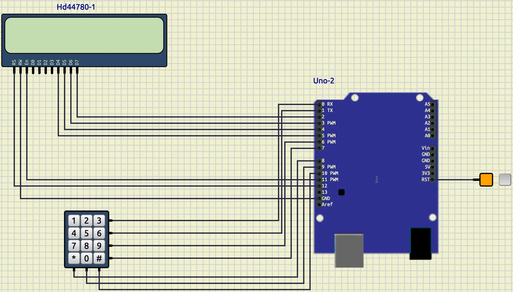
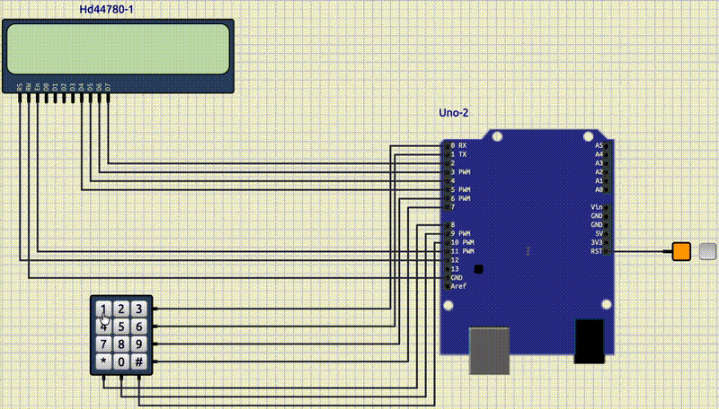

# LCD and Keypad

## Introduction

In the previous tutorial, we have discussed **7-segment**.
Now, we are going to learn how to work with **LCD** and **Keypad**.

## LCD

LCD is used to write parameters and status.
We have a `16x2 LCD` (16 columns and 2 rows).
It has 16-pins.

| VSS    | VCC | VEE              |
|--------|-----|------------------|
| Ground | 5V+ | Contrast Control |

| RS              | RW           | E      |
|-----------------|--------------|--------|
| Register select | Read / Write | Enable |

| D0         | D1         | D2         | D3         | D4         | D5         | D6         | D7         |
|------------|------------|------------|------------|------------|------------|------------|------------|
| Data pin 0 | Data pin 1 | Data pin 2 | Data pin 3 | Data pin 4 | Data pin 5 | Data pin 6 | Data pin 7 |

| LED+    | LED-       |
|---------|------------|
| LED 5V+ | LED Ground |



## Connect an LCD to an Arduino in SimulIDE

Let's put an **LCD** on the board.
To do that we can use **Outputs/Displays/HD44780**.
After putting that on the board, we should connect the pins of it like below:

* RS: 12
* RW: ground
* E: 11
* D4: 5
* D6: 4
* D7: 3
* D8: 2

The result should be something like below:



## Liquid Crystal

**Liquid Crystal** is a well-known package that helps us to work with **LCD**.
This package contain so many great and useful functions.
You can see the list of all functions in
[this link](https://docs.arduino.cc/libraries/liquidcrystal/).

### Add LiquidCrystal to PlatformIO

To add **LiquidCrystal** to a **PlatformIO** project we should add this code
to `platformio.ini`.

```ini
lib_deps =
  arduino-libraries/LiquidCrystal
```

This code will download the **LiquidCrystal** and then you can import it
in your `main.cpp` like below:

```cpp
#include <LiquidCrystal.h>
```

### Make an LCD Object

Now, let's make an **LCD** object using **LiquidCrystal**.
To do so, we can use the code below:

```cpp
const int rs = 12, en = 11, d4 = 5, d5 = 4, d6 = 3, d7 = 2;
LiquidCrystal lcd(rs, en, d4, d5, d6, d7);
```

In the code above, at first we defined the pins in a way that we connected them to our **Arduino Uno**.
Then, we made an object of `LiquidCrystal` with those pins with the name of `lcd`.
We put that code on top of the `setup` and `loop` function to be global.
Now, let's talk about the functions that we can use for this object.

### `begin`

This function initializes the **LCD**.
It automatically sets all the pin modes and should be called before any other **LCD** commands.

The usual syntax that we use:

```cpp
lcd.begin(cols, rows);
```

Example:

```cpp
lcd.begin(16, 2);
```

### `write`

Write a character on the **LCD**.

Syntax:

```cpp
lcd.write(ch);
```

Example:

```cpp
lcd.write('h');
```

### `print`

Write a text on the **LCD**.

Syntax:

```cpp
lcd.print(text);
```

Example:

```cpp
lcd.print("Hello World!");
```

### `setCursor`

Jumps to the given column and row.

Syntax:

```cpp
lcd.setCursor(col, row);
```

Example:

```cpp
lcd.setCursor(5, 1);
```

### `clear`

Clears the **LCD** and jumps to the start.

```cpp
lcd.clear();
```

Example:

```cpp
lcd.clear();
```

## LCD Hello World

Now, that we know about **Liquid Crystal** and the functions that we can use, let's write a simple example.
We want our **LCD** to show **hello** at the first row, starting from the 3rd column.
After some pause, clear the hello and show **world** at the second row starting from the 4th column.
Your output should be something like below:



## Keypad

**Keypad** is a series of keys in a matrix.
It contains of keys in rows and columns.
For example, if we have 4 rows and 3 columns we would have 12 keys.
The advantage that a keypad gives us is that we don't require to occupy 12 pins to control 12 keys.
Instead, we only need 7 pins, 4 for rows and 3 for columns.
Here is an example of a **Keypad** in **SimulIDE**.


### Add Keypad to Arduino Uno in SimulIDE

Now, let's add a keypad to our **Arduino Uno** in our **SimulIDE**.
We can access to the **Keypad** in **Switches/Keypad**.
When you put it on the board, you can see there are **4 rows** and **3 columns**.
Let's connect each row and column like below:

* row-0: 0
* row-1: 1
* row-2: 6
* row-3: 7
* col-0: 8
* col-1: 9
* col-2: 10

You should have something like this:



### Add Keypad to PlatformIO

To use **Keypad** in Arduino, we can use a library called **Keypad**.
We can simply add **Keypad** to our **PlatformIO** project by adding it to the **lib_deps** in **platformio.ini**,
like below:

```ini
lib_deps =
  ...
  Keypad
```

Now we are able to import it like in our **main.cpp** like below:

```cpp
#include <Keypad.h>
```

### Make a keypad Object

To create a object for our **Keypad** we should at first define a matrix for our keys like below:

```cpp
const byte ROWS = 4;
const byte COLS = 3;

char keys[ROWS][COLS] = {
    {'1', '2', '3'},
    {'4', '5', '6'},
    {'7', '8', '9'},
    {'*', '0', '#'}};
```

As you can see, we have defined two constants called **ROWS** and **COLS** which each of them represent how many rows
and columns we have.
Then we defined our matrix of keys in a way that we have them in our **Keypad**.
Now, it's time to define which pins are connected to each row and column.
To do that we can write something like below:

```cpp
byte rowPins[ROWS] = {0, 1, 6, 7};
byte colPins[COLS] = {8, 9, 10};
```

As you recall, in our simulation we have connected our rows to the pins of **0, 1, 6, 7**
and columns to **8, 9, 10**.
We defined **rowPins** and **colPins** to have those values.
Now, let's define our **Keypad Object**.
To do so, we can use the code below:

```cpp
Keypad keypad = Keypad(makeKeymap(keys), rowPins, colPins, ROWS, COLS);
```

As you can see, in the code above, we have used `Keypad` class to create an instance of a **Keypad**.
For the first argument, we changed our `keys` which were in a matrix to the format that `Keypad` likes, using
`makeKeymap` function.
Then for the other arguments, we gave `rowPins`, `colPins`, `ROWS`, and `Cols` respectively.
We named our object `keypad` which we are going to use it later.
Now, let's talk about the function that we are mostly going to use.

### `getKey`

A function that checks if any keys is pressed.
If a key was pressed, it would return the respective key and if not it would return `0`.

Syntax:

```cpp
getKey();
```

Example:

```cpp
char key = keypad.getKey();
```

## Keypad to LCD

Now, let's write a program that displays the output of the **KeyPad** on the **LCD**.
Your output should be like this:



## Login system

Now, let's write a login system.
We have a username and password stored in our code (hard codded).
We want user to enter a username and password.
After that we are going to check if he has entered the correct ones or not.
If it was correct we tell him it is correct, otherwise we tell him it
was incorrect.
Your output should be something like below:

* Correct username: `12`
* Correct password: `5662`
* Enter: `#`


## Conclusion

In this tutorial, we learned how to use **LCD** and **Keypad** in **Arduino Uno**.
First, we explained what **LCD** is and how to use **LiquidCrystal** to control it.
Then we explained the most important functions and provided an example.
After that, we talked about **Keypad**.
We introduced a library with the same name to control it.
Then, we combined **LCD** and **Keypad**.
Finally, we provided an example to make you understand these concepts better.
