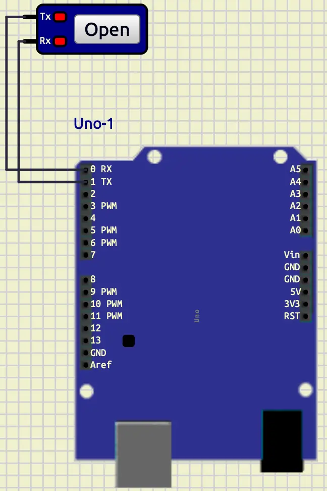
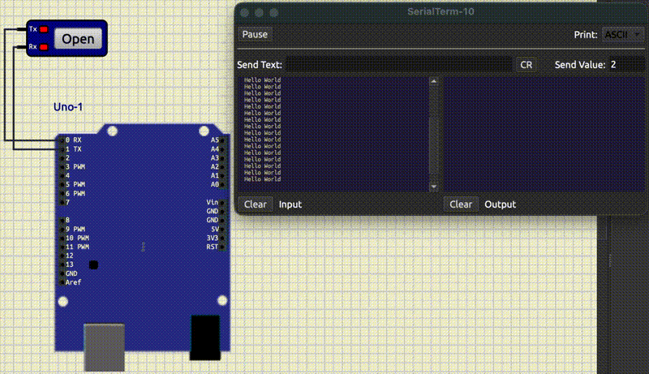

# Serial and Analog read

## Introduction

In the previous tutorial, we learned how to work with **LCD** and **Keypad**.
In this tutorial, at first, we are going to learn about **Serial Communication**.
Then we are going to learn how to read **Analog** data in **Arduino** instead of only **0** and **1**.

## Serial communication

**Serial communication** is a way that a microcontroller can send and receive data one bit at a time. 
You can use it to communicate with computers, microcontrollers, and modules (e.g., GPS, Bluetooth, ESP8266).
**Serial communication** is one of the most important concepts in microcontrollers.
**Arduino Uno** uses **UART** (Universal Asynchronous Receiver-Transmitter) to handle the **Serial communication**.
**UART** needs two pins, one for receiving data (RX) and one for transmitting data (TX). 
These two pins are available in **Arduino Uno** in **pin 0** (RX) and **pin 1** (TX).
Also, we can have **Serial Communication** with **USB** as well.
One of the most important things in having a **Serial Communication** is setting the correct **baud rate** for both
of the devices that are trying to communicate.
**Baud rate** indicates the speed of data transfer.
The reason that **baud rate** should be the same for both devices is that, we have an **asynchronous** communication.
The start and the end of the communication are determined with **start bit** and **end bit**. 

### Serial Terminal on SimulIDE

One of the ways that we can use **Serial communication** is by using a **Serial Terminal**.
You can access a **Serial Terminal** in **Micro/Peripherals/Serial Terminal**.
Now, let's put a **Serial Terminal** on the board and connect it to an **Arduino Uno**.
To do that, we should wire them like below:

* **TX** of **Arduino** -> **RX** of **Serial Terminal**
* **RX** of **Arduino** -> **TX** of **Serial Terminal**

You should have something like this:



### Serial Hello World

Now, let's create a **PlatformIO** project and write a **Hello World** for **Serial communication**.
At first, let's initialize the **Serial Communication**.
To do so, we can use the code below:

```cpp
Serial.begin(9600);
```

In the code above, we set the **baud rate** of our **Serial communication** 
(default **baud rate** in **Serial Terminal** in **SimulIDE**) to 9600 and initialize the **Serial communication**.
(To change the **baud rate** of the **Serial Terminal** in **SimulIDE** you can go to the properties of 
that **Serial Terminal**).
Now, we are ready to write something on it.
To do so, we can use the code below:

```cpp
Serial.println("Hello World");
```

In the code above, we have printed `Hello World` into the serial port.
The function `println`, prints the given input and makes a new line.
Now, let's change our code in a way that it prints `Hello World` every one second.
So we have the full code like below:

```cpp
#include <Arduino.h>

void setup()
{
  Serial.begin(9600);
}

void loop()
{
  Serial.println("Hello World");
  delay(1000);
}
```

Let's upload it into our **SimulIDE**.
After pressing start simulation, you should click on the **open** button on the **Serial Terminal**.
Your output would be something like below:



As you can see in the left panel **Hello World** is being printed constantly.
Also, **Rx** on the terminal becomes **yellow** whenever it receives data.
