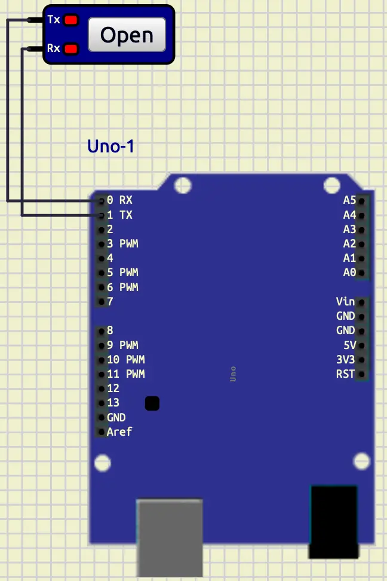
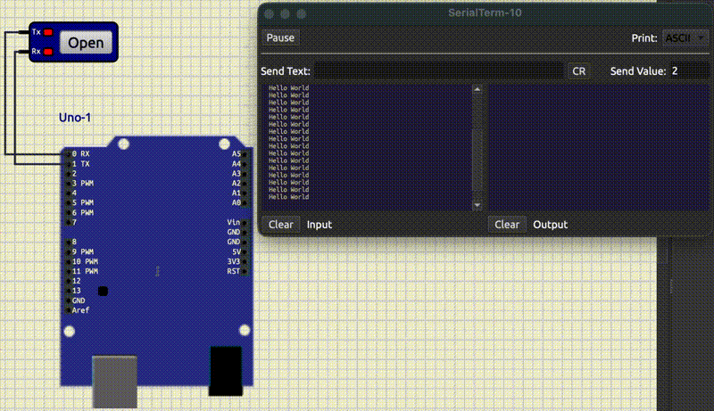
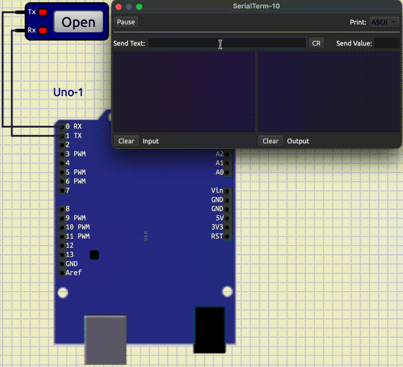
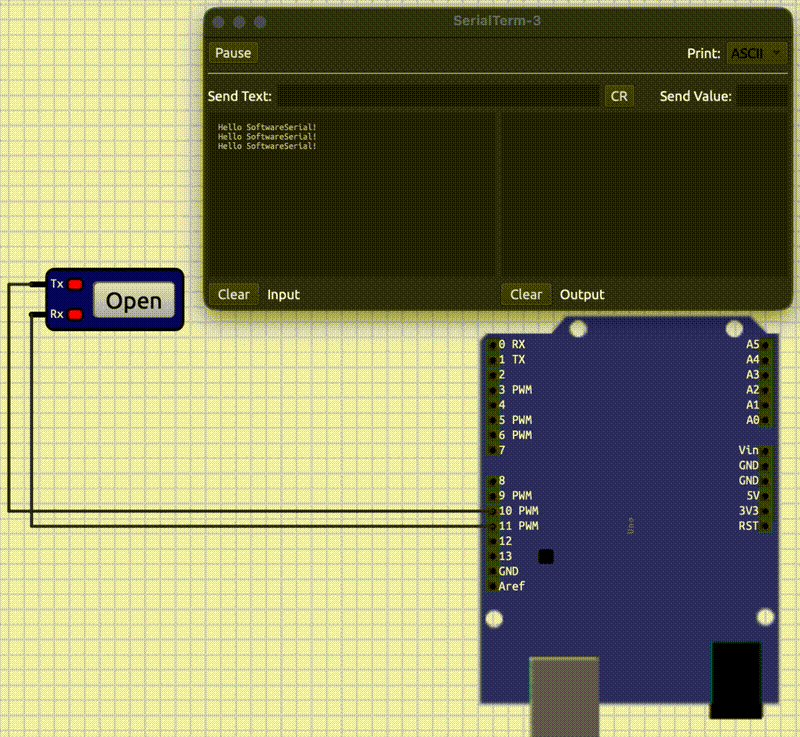
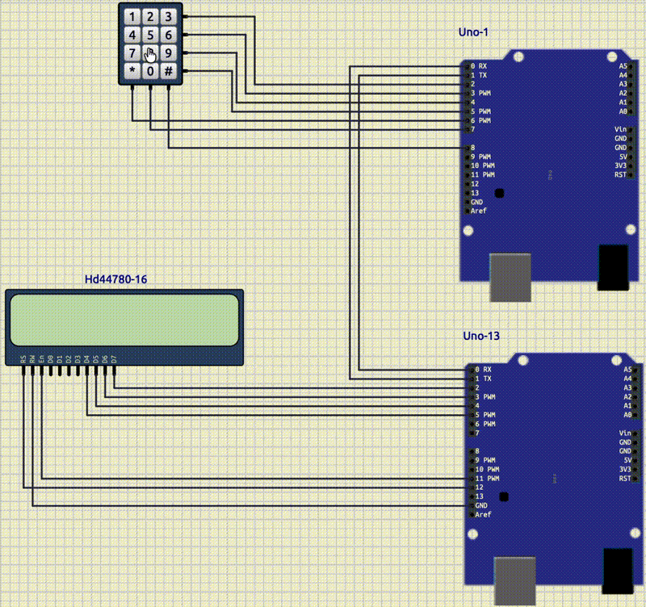

# Serial Communication

## Introduction

In the previous tutorial, we learned how to work with **LCD** and **Keypad**.
In this tutorial, we are going to learn about **Serial Communication** and some of its usages.

## Serial communication

**Serial communication** is a way that a microcontroller can send and receive data one bit at a time. 
You can use it to communicate with computers, microcontrollers, and modules (e.g., GPS, Bluetooth, ESP8266).
**Serial communication** is one of the most important concepts in microcontrollers.
**Arduino Uno** uses **UART** (Universal Asynchronous Receiver-Transmitter) to handle the **Serial communication**.
**UART** needs two pins, one for receiving data (RX) and one for transmitting data (TX). 
These two pins are available in **Arduino Uno** in **pin 0** (RX) and **pin 1** (TX).
Also, we can have **Serial Communication** with **USB** as well.
One of the most important things in having a **Serial Communication** is setting the correct **baud rate** for both
of the devices that are trying to communicate.
**Baud rate** indicates the speed of data transfer.
The reason that **baud rate** should be the same for both devices is that, we have an **asynchronous** communication.
The start and the end of the communication are determined with **start bit** and **end bit**. 

## Serial Terminal on SimulIDE

One of the ways that we can use **Serial communication** is by using a **Serial Terminal**.
You can access a **Serial Terminal** in **Micro/Peripherals/Serial Terminal**.
Now, let's put a **Serial Terminal** on the board and connect it to an **Arduino Uno**.
To do that, we should wire them like below:

* **TX** of **Arduino** -> **RX** of **Serial Terminal**
* **RX** of **Arduino** -> **TX** of **Serial Terminal**

You should have something like this:



## Serial Hello World

Now, let's create a **PlatformIO** project and write a **Hello World** for **Serial communication**.
At first, let's initialize the **Serial Communication**.
To do so, we can use the code below:

```cpp
Serial.begin(9600);
```

In the code above, we set the **baud rate** of our **Serial communication** 
(default **baud rate** in **Serial Terminal** in **SimulIDE**) to 9600 and initialize the **Serial communication**.
(To change the **baud rate** of the **Serial Terminal** in **SimulIDE** you can go to the properties of 
that **Serial Terminal**).
Now, we are ready to write something on it.
To do so, we can use the code below:

```cpp
Serial.println("Hello World");
```

In the code above, we have printed `Hello World` into the serial port.
The function `println`, prints the given input and makes a new line.
Now, let's change our code in a way that it prints `Hello World` every one second.
So we have the full code like below:

```cpp
#include <Arduino.h>

void setup()
{
  Serial.begin(9600);
}

void loop()
{
  Serial.println("Hello World");
  delay(1000);
}
```

Let's upload it into our **SimulIDE**.
After pressing start simulation, you should click on the **open** button on the **Serial Terminal**.
Your output would be something like below:



As you can see in the left panel **Hello World** is being printed constantly.
Also, **Rx** on the terminal becomes **yellow** whenever it receives data.

## Read from Serial Terminal

We have managed to send data to the **Serial Terminal**.
Now, let's talk about how to read data from it.
To do so we can use a function called `Serial.read()`.
It would read the incoming **byte**.
If there is no data, it would return `-1`.
Also, we have another function called `Serial.available()`.
This function returns the number of bytes which are available for reading.
So if we want to write a code that reads data and prints each character in separate lines,
we can write something like below in the loop function:

```cpp
if (Serial.available())
{
    char ch = Serial.read();
    Serial.println(ch);
}
```

The output would be something like below:


In the example above, I wrote **hello** and **world** separately.
After I wrote down each one of them I pressed **Enter**.
As you can see in the right panel, we can see the input that we sent to
the **Arduino** and in the left panel we can see the response of the **Arduino**.

## Read until new line

If we want to read the whole string, we can use a function called
`Serial.readStringUntil`.
This function reads the data in the buffer until it reaches the terminator that we give it as an argument.
As a result it returns a **String**.
So, if we want to change our code to read the whole line, we can change it like below:

```cpp
if (Serial.available())
{
    String result = Serial.readStringUntil('\n');
    Serial.println(result);
}
```

The output would be something like this:



As you can see, we write a whole sentence and when we press enter after some time it would print us the result.

## Built-it Serial Monitor in SimulIDE

For debugging purposes, **SimulIDE** has implemented a **Serial Monitor** that you can see
the transmitted and received data through that.
To access it, you can right-click on the **Arduino Uno** then select **mega328/Open Serial Monitor/USart**.

## Software Serial

The built-in pins for **Serial Communication** in **Arduino Uno** are **pin 0, 1**.
This is managed by hardware.
If you want to use other pins for the **Serial communication**, you should use a package called `SoftwareSerial`. 
You can import it like below: 

```cpp
#include <SoftwareSerial.h>
```

To tell the `SoftwareSerial` which ports you need, you should make an object like below:

```cpp
SoftwareSerial mySerial(10, 11); // RX, TX
```

In the code above, we have used **pin 10** for **RX** and **pin 11** for **TX**.
Now, we are ready to connect the device that we want to communicate with to **pin 10 and 11** and start our 
**Serial communication** as we would before.
The whole code for a **Hello World** example is like this:

```cpp
#include <Arduino.h>
#include <SoftwareSerial.h>

SoftwareSerial mySerial(10, 11); // RX, TX

void setup()
{
  mySerial.begin(9600);
}

void loop()
{
  mySerial.println("Hello SoftwareSerial!");
  delay(1000);
}
```

Your output should look like below:



## Counter on two Arduinos

Now, that we know how two devices can communicate using **Serial communication**, let's connect two **Arduinos**
together.
We add a **Keypad** to the first **Arduino**.
Its job is to receive a number and send it to the second Arduino.
Then, we add an **LCD** to the second Arduino.
Its job is to count down the number that it received to `0`.
Your output should look like this:

