# Analog

## Introduction

In the previous tutorials, we were focusing on **digital** read and write.
We could only write and read **0** and **1** from a pin.
In this tutorial, we will discuss how to write and read values between **0**
and **1**.

## Analog Read

In the previous tutorials, we were working with **digital** input and output.
As you recall, to read a **digital** input, we had a function called `digitalRead`.
To read **analog** input, we have a function as well.
This function is called `analogRead`.
The syntax of it is pretty similar to the `digitalRead`, the only exception is that it returns a number
in a range of $[0, 1023]$.
As you might have guessed from the range, `Arduino Uno` allocates `10 bits` for reading analog data.

In `Arduino Uno`, we have $6$ pins that we can use to read **Analog** input.
These pins are labeled as **A0** to **A5**.
In the image below, we show them by drawing a yello rectangle over them.

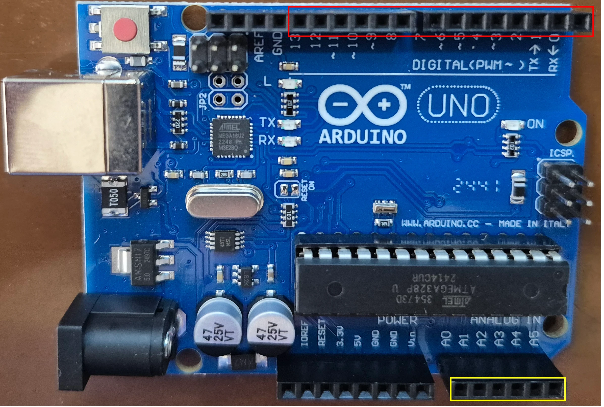

For reading digital values, $5V$ indicates $1$ and $0V$ indicates $0$.
For analog values, $5V$ indicates $1023$ and $0V$ indicates $0$.
As you can see, we divide the values between $5V$ and $0V$ into $1024$ parts.
With using this technique, we are being able to read voltage between $5V$ and $0V$.

### Potentiometer

To create a voltage between $5V$ and $0V$, we can use a device called **Potentiometer**.
You can find it at **Passive/Resistors/Potentiometer** in **SimulIDE**.
As you can see, a **Potentiometer** has $3$ pins and a button to control the output voltage.
**Potentiometer** creates voltage with increasing and decreasing the resistance. 
Let's connect a **Potentiometer** to a fixed voltage to see how it works.
To do so, we can follow these steps:

* Put a **Potentiometer** on the board (**Passive/Resistors/Potentiometer**).
* Connect the pin that is closer to a red line, to a **Fixed Voltage**.
* Connect the other pin to the **Ground**.
* Put a **VoltMeter** on the board (**Meters/VoltMeter**).
* Connect the output pin of the **Potentiometer** (the pin with the arrow on it) to the **red pin** of the **VoltMeter**.
* Connect the other pin of the **VoltMeter** (the pin beside the red pin) to the ground.

Your connection, should look like as following:

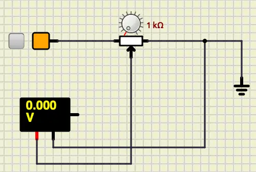

Now, let's start the simulation and rotate the button on the **Potentiometer**.

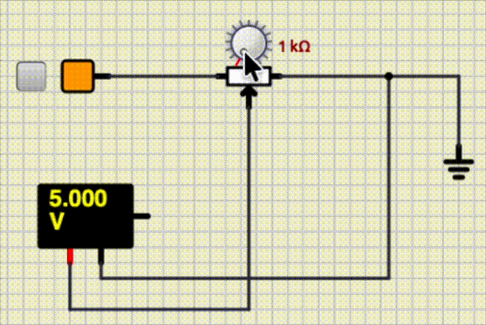

As you can see, we can make voltages between $5V$ and $0V$.

### Potentiometer and Arduino

Now, let's connect our **Potentiometer** to the Arduino.
The steps are pretty much the same.

* Connect the pin closer to the red line to a **5V**. 
* Connect the pin on the opposite of the red line to the **Ground**.
* Connect the output pin (pin with an arrow on it) to **A0**.

Your connection should look like this:

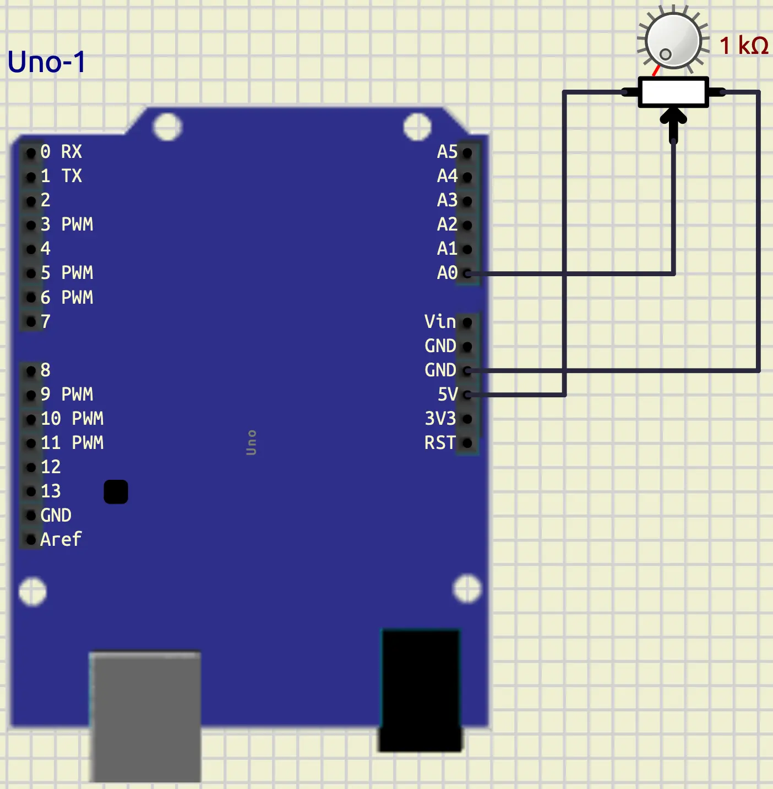

Now, let's write a code to read the analog data.

```cpp
#include <Arduino.h>

void setup()
{
  Serial.begin(9600);
}

void loop()
{
  int our_input = analogRead(A0);
  Serial.println(String(our_input));
  delay(1000);
}
```

The code above, reads the analog input from `A0`.
Then, it prints the read value into Serial terminal.
The output looks like as following:

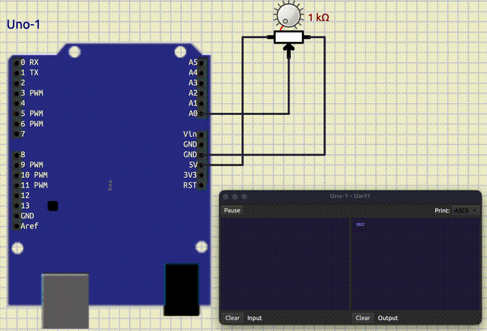

## PWM

Before we get to work with **Analog Write**, let's learn about **PWM**.
Because **Arduino Uno** uses **PWM** to write **Analog** data.
**PWM** (Pulse Width Modulation), is a technique for controlling the power delivered to a component.  
In this technique we use different width of pulses in a signal.
These signals switch between $0$ and $1$.
The percentage of the time that a pulse is $1$ is called **duty cycle**.
The pictures below show two examples of 100Hz **PWM**, one with the 30% duty cycle and the other 60%.

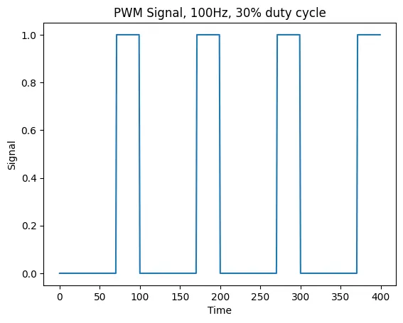

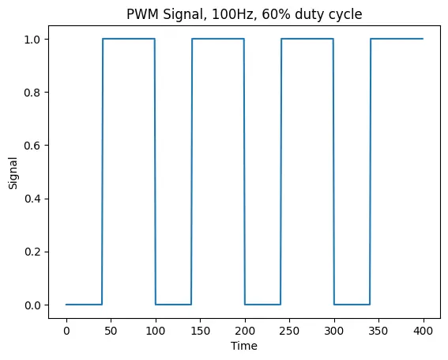

## Analog Write

Now, that we know about **PWM**, let's connect talk about writing analog data in **Arduino uno**.
In **Arduino Uno** we have $6$ pins that we can create **PWM** on them.
Including: $3$, $5$, $6$, $9$, $10$, and $11$
These pins are shown in the board with a **~** beside them
and in **SimulIDE** with **PWM**.
To create our **duty cycles**, we can use the numbers in range $[0, 255]$.
$255$ means $100%$ and $0$ means $0%$ duty cycles.

For writing **digital** values, we had a function called `digitalWrite`.
We have a similar function for **analog** values as well, and it is called:
`analogWrite`.
Their syntax is similar, with the exception that `analogWrite` accepts an
integer for its second argument.

Now, let's connect an **LED** to pin $3$.
Your connection should look like below:

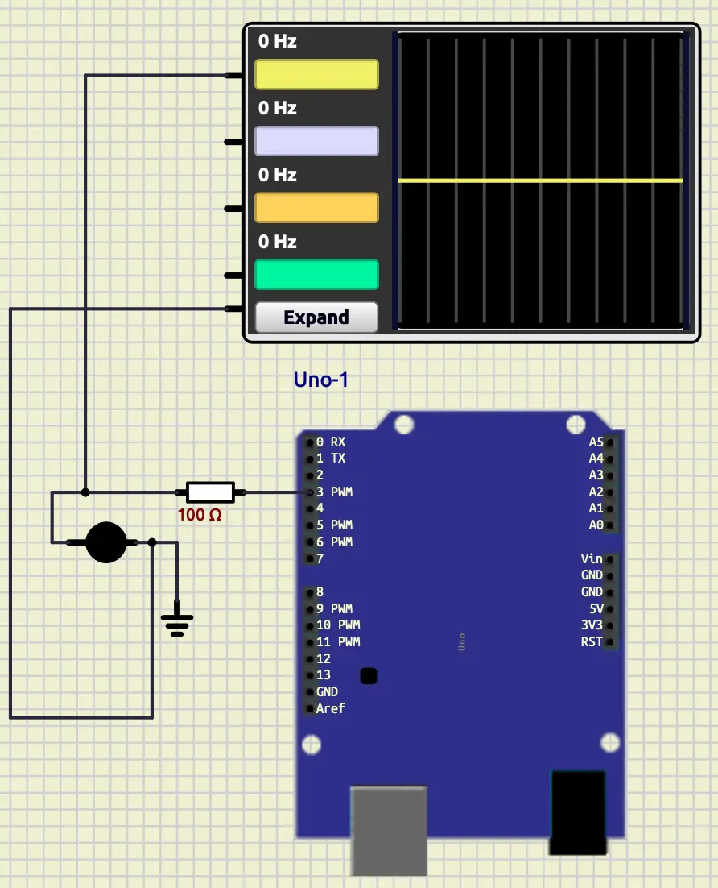

Now, let's write a code to write analog data on pin $3$.

```cpp
#include <Arduino.h>

void setup()
{
  pinMode(3, OUTPUT);
}

void loop()
{
  for (int i = 0; i < 256; i++)
  {
    analogWrite(3, i);
    delay(10);
  }
}
```

In the code above, first we set the pin mode of pin 3 as output.
Then, we have a for loop that starts from $0$ and goes until $256$.
So, we expect the brightness of our **LED** changes from dark to light.
As you can see in the output below, this is the exact thing that is happening.


If we want to see the **PWM** that we are generating, we can connect an
**Oscope** to our output.
To do so, we can follow these steps:

* Put an **Oscope** on the board (**Meters/Oscope**)
* Connect the bottom pin to the ground
* Connect any other pin to the output of pin $3$.

Your output should look like as following:

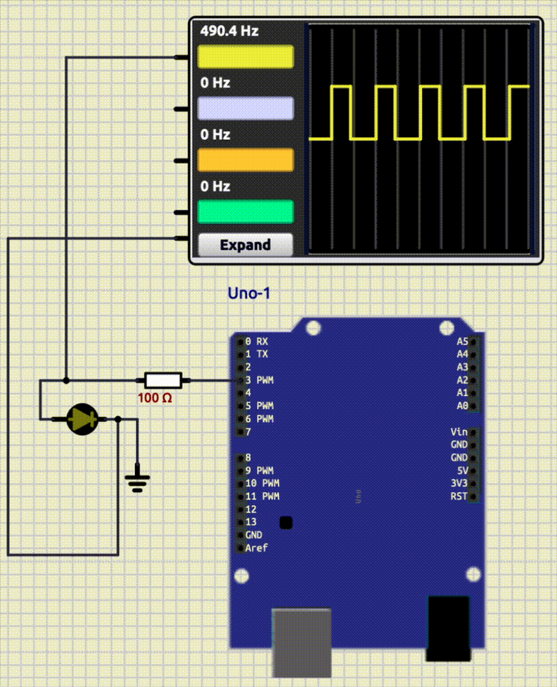

## Combining both

Now, let's combine the both reading and writing analog values together.
Your connection should look like below:

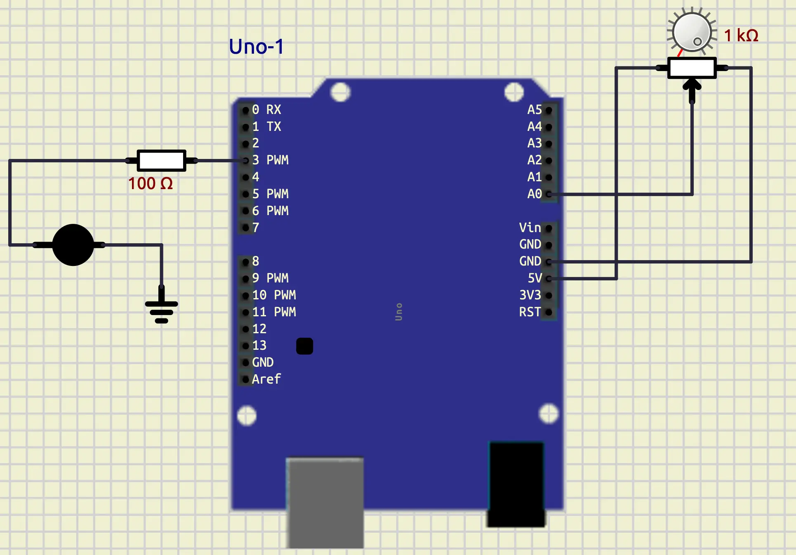

Now, let's write a code that changes the brightness of the **LED**
using the **Potentiometer**.

```cpp
#include <Arduino.h>

void setup()
{
  pinMode(3, OUTPUT);
}

void loop()
{
  int our_input = analogRead(A0);
  int brightness = map(our_input, 0, 1023, 0, 255);
  analogWrite(3, brightness);
  delay(1000);
}
```

As you can see, in the code above, we read analog data from pin `A0`.
The value is in the range of $[0, 1023]$.
To write it on the pin $3$, we need to rescale the value to the range of $[0, 255]$.
To do so, we have used a function called `map`.
This function takes our input as its first argument, then takes the current range
and the target range and outputs the rescaled value.
After that, we are able to write that rescaled value to pin $3$.
The output looks like as following:


If we want to see the **PWM**, we can connect an **Oscope** like below:

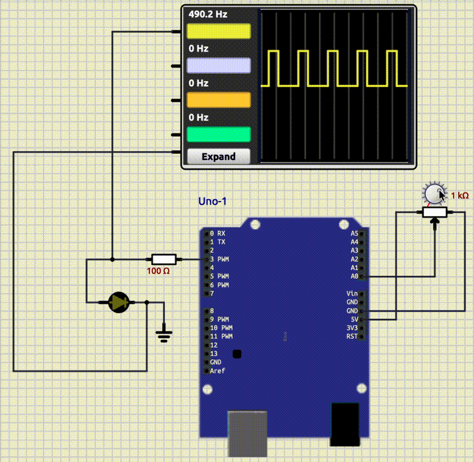

## DC motor

**DC motor** is a device that converts electrical energy into rotation.
We use a **DC motor** in so many different things like, saw, drill, toys and e.t.c.
To connect a **DC Motor** to an Arduino we should consider that, a **DC Motor**
takes too much current, and we should not connect it directly to an **Arduino pin**.
In **SimulIDE** it is not going to be a problem, but in real life we should not do that.
To practice real life connection, we use a battery to power our **DC motor**.
Also, we use a **Mosfet** to write analog data on our **DC motor**.
Now, let's change our **LED** to a **DC motor** with these following steps:

* Remove the **LED**
* Put a **DC motor** on the board (**Outputs/Motors/DC Motor**).
* Put a **Battery** on the board (**Sources/Battery**).
* Put a **Mosfet** on the board (**Active/Transistor/Mosfet**).
* Connect pin $3$ to the middle pin of the mosfet (pin with the arrow).
* Connect one pin of the mosfet to the ground.
* Connect the other pin of the mosfet to the negative (-) of the **DC Motor**.
* Connect the positive (+) of the motor to the positive (red) of the battery.
* Connect the negative (black) of the battery to the ground.

Your connection should look like below:

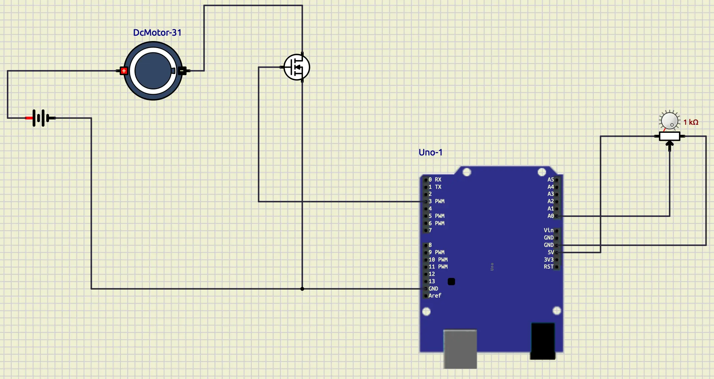

There is no need to change our code.
So, if we run our simulation with the code that we already have written for the **LED**,
the output would look like below:

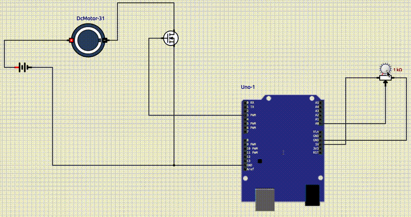

## Servo Motor

**Servo motor** is a type of electric motor that is designed for precise control.
It is widely used in robotics.
We can control the position of the servo motor by sending a **PWM** signal to it.
In this session, we will be using a simple DC servo motor which only take
angles in range of [-90, 90].
The desired `PWM` frequency for this servo motor is `50Hz`.
This servo motor has three pins: VCC, GND, and signal.
So, let's connect a **Servo motor** to an **Arduino Uno**.

* Put a **Servo motor** on the board (**Outputs/Motors/Servo Motor**).


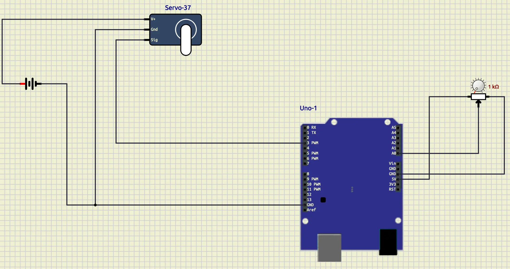


So, to control a **Servo motor** we need to create a **PWM** signal with the frequency **50hz**.
To do so, we can use a library called **Servo**.
We can add it to our **PlatformIO project like this:

```ini
lib_deps =
        ...
        arduino-libraries/Servo
```

Then, we can include it like below:

```cpp
#include <Servo.h>
```

Now, we should create an object of `Servo` like below:

```cpp
Servo my_servo;
```

Then, we need to do the initialization by using a function called `attach`.
For example, let's attach our servo to pin $3$.

```cpp
my_servo.attach(3);
```

Then we can use the `write` function to write the angle that we want.
For example let's write $45$ on it.

```cpp
my_servo.write(45);
```

Now, write a code that maps the data of the **Potentiometer** to the servo angles.
Your output should look like as following:

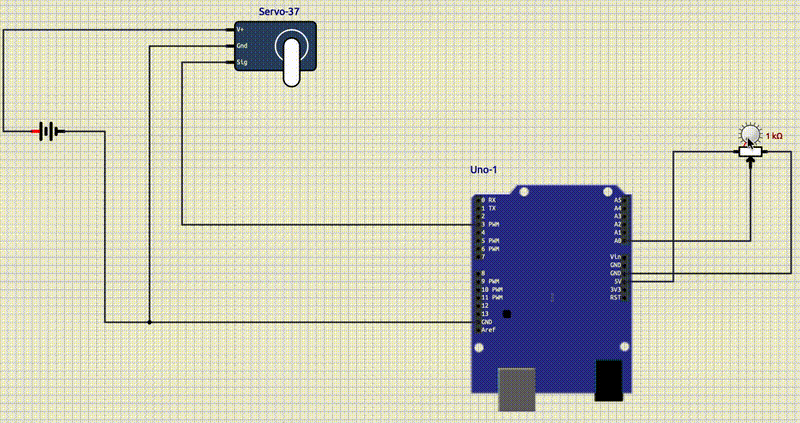

If we want to see the generated **PWM**, we can add a **Oscope**
like below:

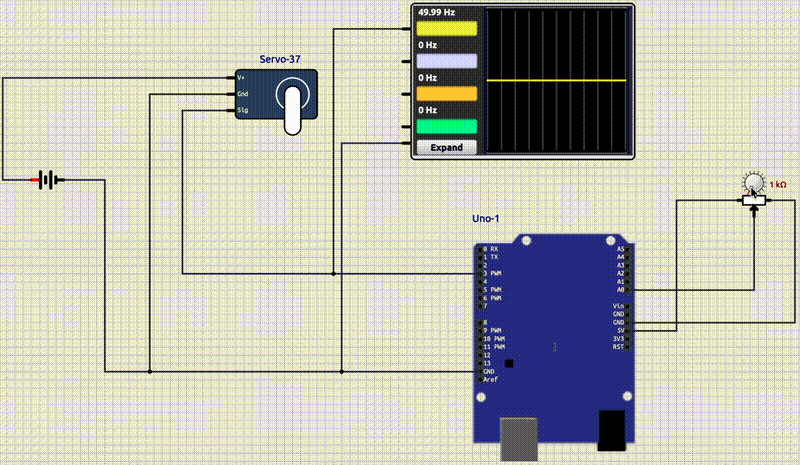

## Combine All

Now, let's combine all the things that I have learned.
Your output should be like below:


## Conclusion
