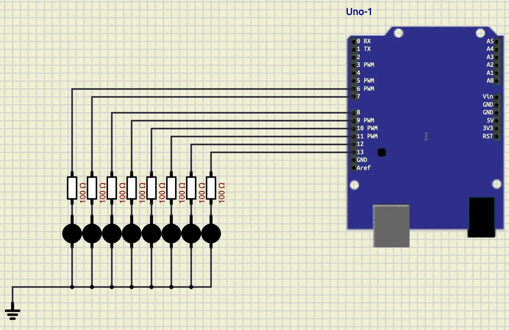
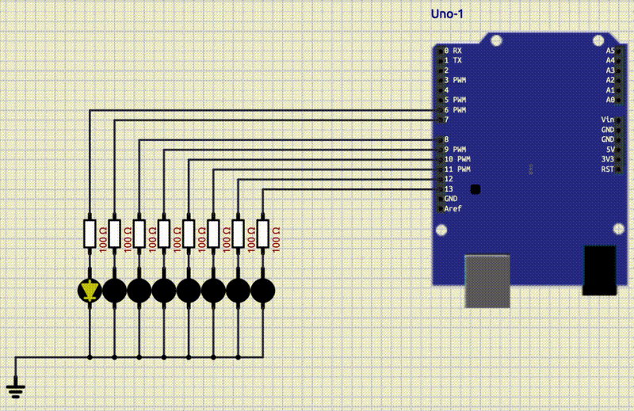
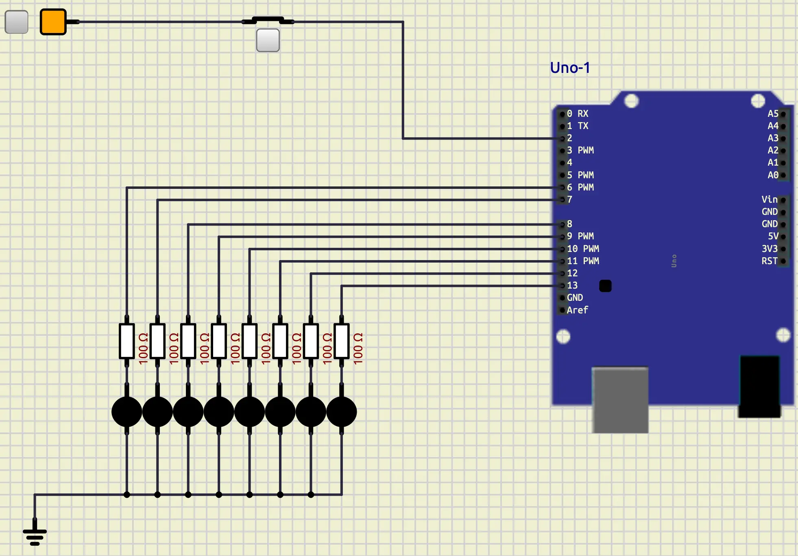
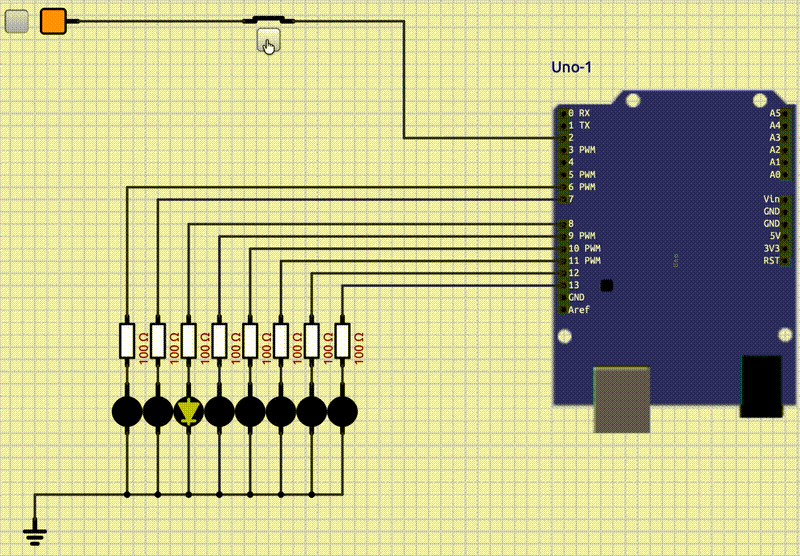
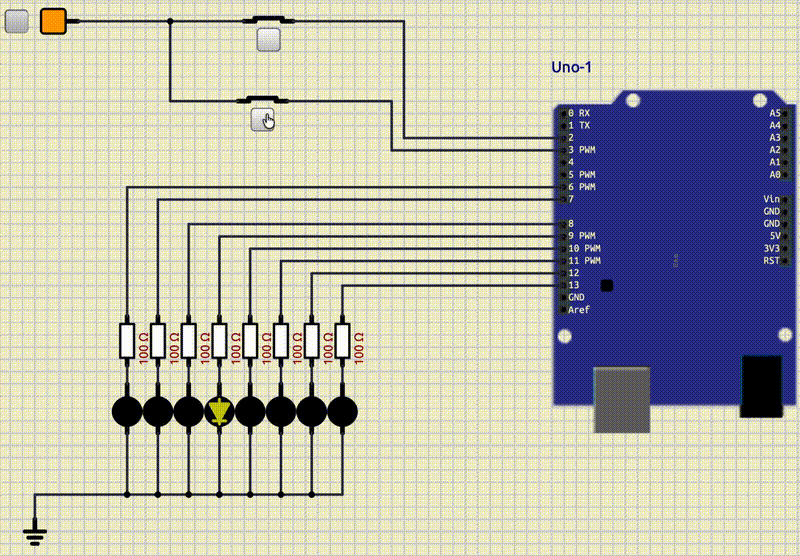
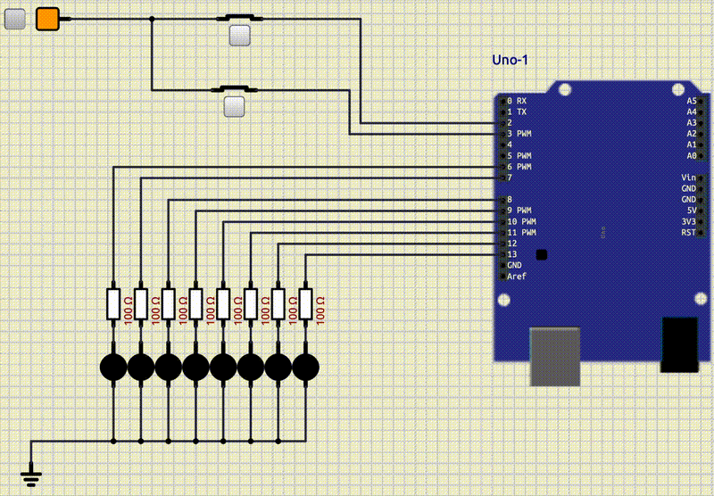

# Interrupt

## Introduction

In the previous session, we learned how to work with analog values in **Arduino Uno**.
In this session we will learn about one of the most important aspects of microcontrollers,
which is called **Interrupt**.
We have different kinds of **Interrupts**, but in this tutorial, we are going to focus on the **External Interrupt**,
which we will explain very soon.

## What is an External Interrupt?

**Interrupt** is a special signal.
It tells the microcontroller to stop (halt) what he is doing right now and execute the given code.
This code, should be in a function called **Interrupt Service Routine Function** (**ISR Function**).
In **Arduino Uno**, we have 2 external **interrupts**.
These **interrupts** are connected to **pin 2** and **pin 3**.
So, if we want to work with these interrupts, we should connect a button to one of these two pins.

## Setup LEDs

To understand the concept of interrupts better, let's make a routine.
The routine that we are going to make, includes $8$ LEDs, which are connected like the image below:



You are free to connect the LEDs to any pin that you want, except pins $0$ to $3$.
We connected our LEDs to pin $6$ to $13$.
Now, let's write a code for these LEDs to turn on in a sequence.

```cpp
#include <Arduino.h>

int led_pins[8] = {6, 7, 8, 9, 10, 11, 12, 13};

int current_led = 0;

void setup()
{
  for (int i = 0; i < 8; i++)
  {
    pinMode(led_pins[i], OUTPUT);
  }
}

void loop()
{
  digitalWrite(led_pins[current_led], HIGH);
  delay(200);
  digitalWrite(led_pins[current_led], LOW);

  current_led++;
  current_led %= 8;
}
```

In the code above, first we have defined which pins we have for our LEDs in a variable called `led_pins`.
Then, we have defined a variable called `current_led`.
`current_led` indicates which led should be on at the moment.
In the `setup` we have defined all of our `led_pins` to `OUTPUT`, because we want to write values in them.
Then, in the `loop` at first we have turned on the first LED and keep it on for `200ms`.
After that, we turned that LED off.
For the next step, we increment the value of `current_led` and make sure that it doesn't go more than $8$.
Our output looks like the following:



Now, we are ready to add an interrupt and see its effect.

## Interrupt to pause

Right now, our LEDs are getting turned on in a sequence.
Our goal is to pause this routine, using an interrupt.
To do so, at first let's connect a button to the **pin 2** like below:



As you can see, in the image above, we set the default position of our button to **Closed**.
To do so, we can go to the properties of the button and set it to **Normally Closed**.
Because, we want to have **5V** by default to the pin and when we press the button, the value
of the pin becomes **0V**.

Now, let's learn how we can define an **interrupt** in **Arduino**.
To do so, we have to use a function called `attachInterrupt`.
This function, takes three arguments:

1. The **pin** that we want the interrupt to work on
2. The **ISR** function
3. The mode

First, let's start with passing the pin as its first argument.
To do so, first we should change the pin to an **Interrupt** pin using a function called **digitalPinToInterrupt**.
For example, if we want our **pin 2** to function as an interrupt, we should right something like below
(We are going to fill the `...` after):

```cpp
attachInterrupt(digitalPinToInterrupt(2), ... ,...);
```

For the second argument, let's define an empty function, that we are going to fill it later,
and pass that function to it.
For example, a function like below:

```cpp
void isr_pause()
{
}
```

So, now we have:

```cpp
attachInterrupt(digitalPinToInterrupt(2), isr_pause ,...);
```

The only remaining thing is the mode.
In **Arduino Uno** we have 4 modes for the interrupts.

| Mode    | Description                                           | figure                                                  |
|---------|-------------------------------------------------------|---------------------------------------------------------|
| LOW     | trigger the interrupt whenever the pin is low.        |        |
| CHANGE  | trigger the interrupt whenever the pin changes value. |  |
| RISING  | trigger when the pin goes from low to high.           |      |
| FALLING | trigger when the pin goes from high to low.           |      |

Now, let's put the mode to **RISING**.
It means that we are going to have an **interrupt** when leave the button.
So, here is the full function call, which we put it in the `setup`.

```cpp
attachInterrupt(digitalPinToInterrupt(2), isr_pause, RISING);
```

Now, it's time to implement the logic.
If an interrupt happens, we want the routine to be paused.
So, we are going to define an integer variable called `x` with default value of `1`.
Instead of incrementing `current_led` by $1$, we are going to increment it by `x`. 
It would look like this: `current_led += x`.
In your `isr_pause` function, we are going to toggle `x`.
So, anytime an interrupt comes, the pausing and resuming happens.
The full code, would look like below:

```cpp
#include <Arduino.h>

int led_pins[8] = {6, 7, 8, 9, 10, 11, 12, 13};

int current_led = 0;
int x = 1;

void isr_pause()
{
  x = 1 - x;
}

void setup()
{
  for (int i = 0; i < 8; i++)
  {
    pinMode(led_pins[i], OUTPUT);
  }

  attachInterrupt(digitalPinToInterrupt(2), isr_pause, RISING);
}

void loop()
{
  digitalWrite(led_pins[current_led], HIGH);
  delay(200);
  digitalWrite(led_pins[current_led], LOW);

  current_led += x;
  current_led %= 8;
}
```

And this is going to be our output:

> Take note that when we press the button, the button goes up and value of the pin becomes 0



## Volatile in Cpp

When we define a variable in **Cpp**, its compiler tends to optimize the usage of it.
Sometimes, this optimization would work against us, specially in **Interrupt Service Routines**.
Because **ISR** is a hardware event and **Cpp** might not plan for it.
To prevent this optimization from happening we can use a keyword called **volatile**.
We should put this keyword before the declaration of our variable.
For example, `volatile int v;`.
This keyword tells **Cpp** not to apply optimization on this variable.

## Reset with Interrupt

Now, add another interrupt to **pin 3**.
This interrupt would reset the routine from the start.
Take note that you might need to use **volatile**.



## Increment pattern

Now, make LEDs with the pattern below.
Make sure that the both interrupts work as intended (one for pausing and one for resetting).



## Conclusion
