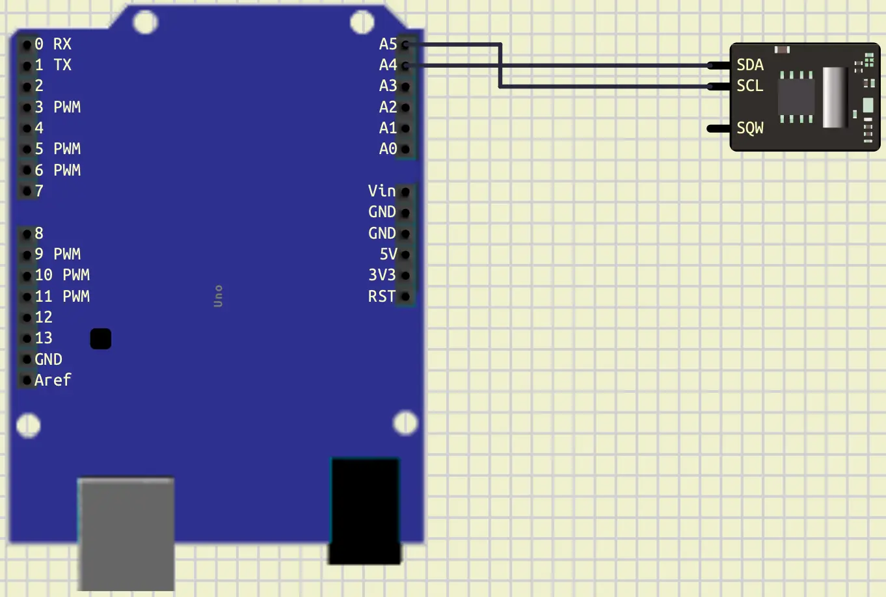
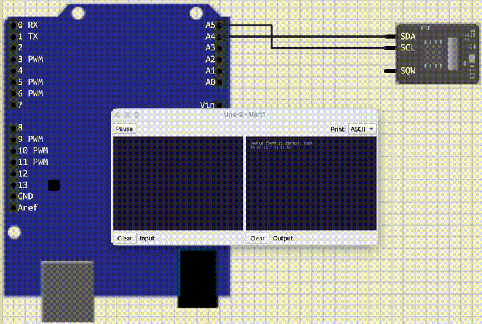
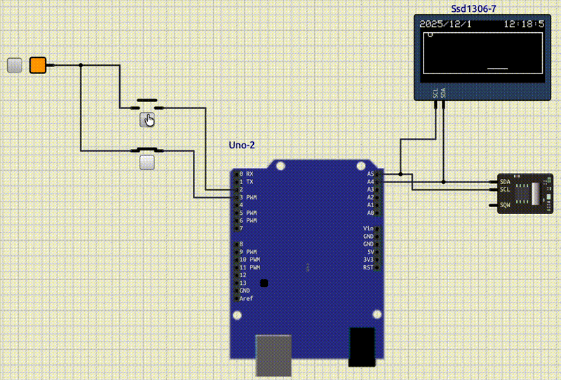

# I2C: part 1

## Introduction

In the previous Tutorial, we learned about **Interrupt**.
In this tutorial we will learn about **I2C** communication.

## I2C Communication

**Inter-Integrated Circuit** (**I2C**), is a two-wire communication protocol.
This protocol is designed for **short-distance communication** between
microcontrollers and peripherals.
It uses two pins to set up the communication:

* **SDA**: Serial Data
* **SCL**: Serial Clock

This way of communication, allows us to connect more than 1 component to the same 2 pins.
For **I2C** every component has its own address.
These addresses are mostly `7-bit`.

**I2C** is a master and slave protocol.
It means that one device (Our Arduino) is a **master**, and the other devices are **slaves**.
A **master** device controls the **clock** created in **SCL**.
Also, **master** decides that if it wants to communicate with a **slave** or not.
Each message of **master** is like below:

| Field         | Bit Count | Description                                                         |
|---------------|-----------|---------------------------------------------------------------------|
| START         | —         | SDA goes LOW while SCL is HIGH → begins communication               |
| Slave Address | 7 bits    | Unique address of target device (0–127)                             |
| R/W Bit       | 1 bit     | 0 = Write, 1 = Read                                                 |
| ACK/NACK      | 1 bit     | Receiver pulls SDA LOW to acknowledge (ACK), HIGH for no-ack (NACK) |
| Data Byte 1   | 8 bits    | First byte of data to write or read                                 |
| ACK/NACK      | 1 bit     | Receiver acknowledges the byte                                      |
| Data Byte 2…N | 8 bits    | Additional data bytes (optional, depends on protocol)               |
| ACK/NACK      | 1 bit     | Acknowledge after each data byte                                    |
| STOP          | —         | SDA goes HIGH while SCL is HIGH → ends communication                |

In the table above, you can see the message structure in **I2C**.
First, **master** puts the **SDA** to low.
This indicates that all **slaves** should listen.
After that, it tells which **slave address** it wants to talk to.
Then, with `1 bit` tells the **slave** if it wants to read or write.
Next, there would be an acknowledgement bit.
If **slave** was available, it would set the acknowledgement bit to `0`.
(The default value of SDA is always `1`).
After that, there would be a byte of data.
Respect to the mode (read or write), **master** can send or receive that byte.
Then, whoever receives the data, should set the acknowledgement bit to `0`.
These byte transfer and acknowledgement can be repeated multiple times, until a stop signal.
Stop signal can be created when we put the SDA to `1`.

To have a **I2C** communication in **Arduino** uno, we should use these pins:

| signal  | pin  |
|---------|------|
| **SDA** | `A4` |
| **SCL** | `A5` |

## Wire

To control the **I2C** communication, **Arduino** has a library called `Wire`.
We can include `Wire` in our code like below:

```cpp
#include <Wire.h>
```

To set up the **I2C** communication, we can use `.begin()` function, like below:

```cpp
Wire.begin();
```

After doing that, we can start a communication with a **slave** in two ways:

* **write**
* **read**

To start a communication with a **slave** in order to **write**, we can use the code below:

```cpp
Wire.beginTransmission(addr);   // start the communication in order to write with the slave with the address of `addr`
Wire.write(data);               // write data
Wire.endTransmission();         // finish transmission
```

If we want to our communication to be a **read** communication, we can

```cpp
Wire.requestFrom(addr, number); // start a read communication with the slave with the address of `addr` and read `number` bytes
Wire.read();                    // read bytes
```

Let's connect an **I2C** component to the **Arduino** and check these functions.

## Finding I2C address

* Connect the clock
* write the code
* Explain the code
* end transmission = 0



```cpp
#include <Arduino.h>
#include <Wire.h>

void setup()
{
  Wire.begin();
  Serial.begin(9600);
}

void loop()
{
  for (int i = 0; i < 127; i++)
  {
    Wire.beginTransmission(i);
    if (Wire.endTransmission() == 0)
    {
      Serial.println("Device found at address: 0x" + String(i, HEX));
    }
  }
  delay(2000);
}
```

## Clock: DS1307

* Storing: 0x22 -> 22 not 2*16+2
* seconds, minutes, hours, weekday, day, month, year
* SQW: Square Wave Output
  * Good for creating interrupts

| Register     | Address |
|--------------|---------|
| Seconds      | 0x00    |
| Minutes      | 0x01    |
| Hours        | 0x02    |
| Day of Week  | 0x03    |
| Day of Month | 0x04    |
| Month        | 0x05    |
| Year         | 0x06    |




> [Link to the Datasheet](https://www.analog.com/media/en/technical-documentation/data-sheets/ds1307.pdf)

## OLED: SSD1306

```ini
lib_deps =
    Adafruit SSD1306
    Adafruit GFX Library
```

```cpp
#include <Adafruit_GFX.h>
#include <Adafruit_SSD1306.h>
```

```cpp
#define SCREEN_WIDTH 128
#define SCREEN_HEIGHT 64

Adafruit_SSD1306 display(SCREEN_WIDTH, SCREEN_HEIGHT, &Wire);
```

```cpp
if (!display.begin(SSD1306_SWITCHCAPVCC, SSD1306_ADDRESS))
{
Serial.println("SSD1306 failed!");
for (;;)
  ;
}

display.setTextSize(1);
display.setTextColor(WHITE, BLACK);
```

```cpp
display.clearDisplay();
display.setCursor(0, 0);
```

```cpp
display.print();
display.display();
```


> [Good Example](https://github.com/adafruit/Adafruit_SSD1306/blob/master/examples/ssd1306_128x64_i2c/ssd1306_128x64_i2c.ino)

## Project




## Conclusion
