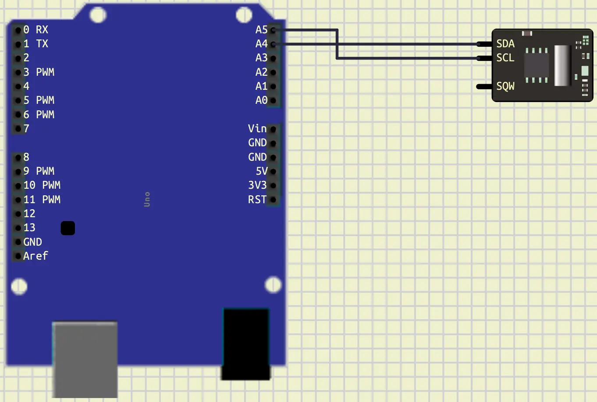
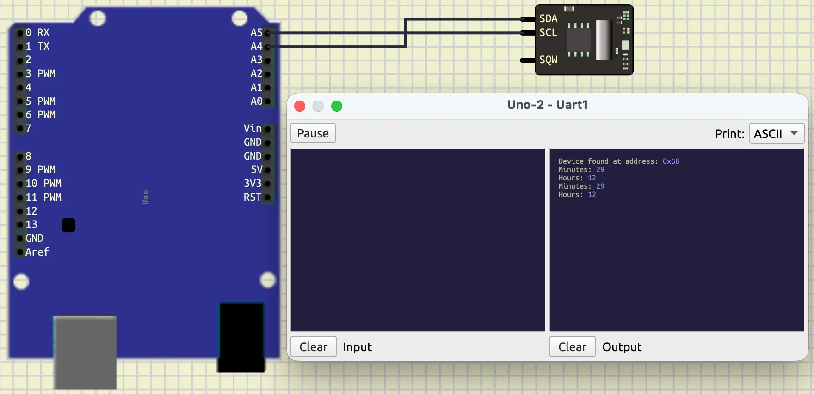
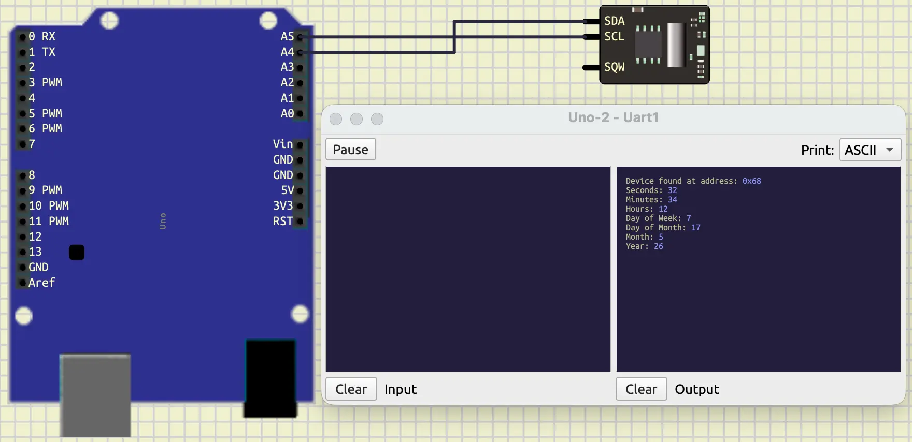
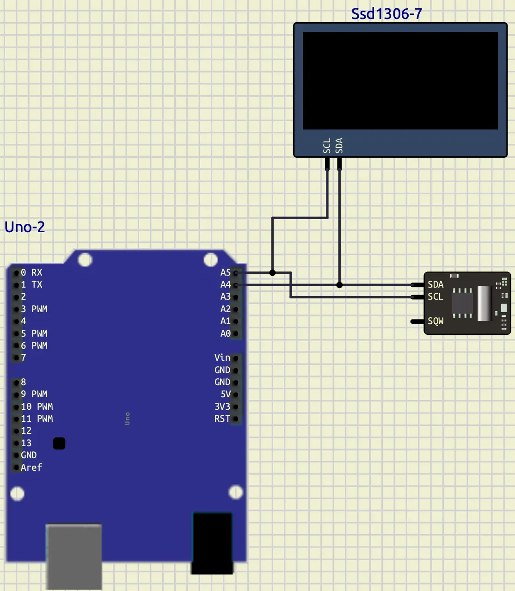
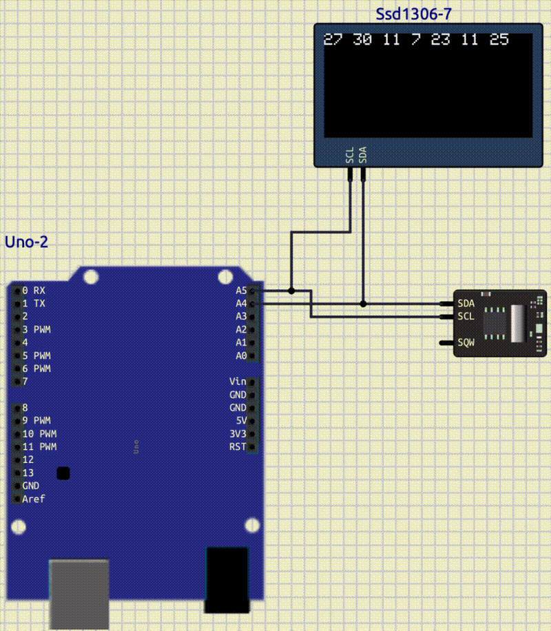
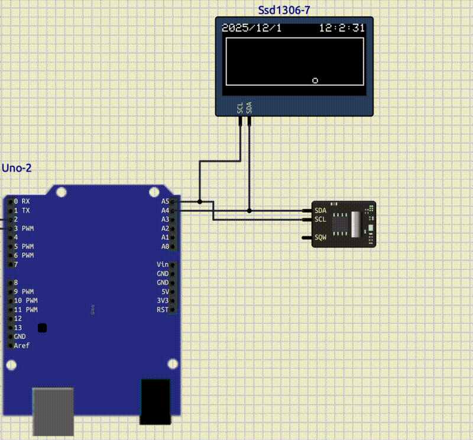
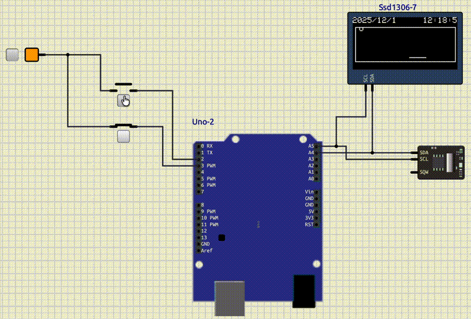

# I2C: part 1

## Introduction

In the previous Tutorial, we learned about **Interrupt**.
In this tutorial we will learn about **I2C** communication.

## I2C Communication

**Inter-Integrated Circuit** (**I2C**), is a two-wire communication protocol.
This protocol is designed for **short-distance communication** between
microcontrollers and peripherals.
It uses two pins to set up the communication:

* **SDA**: Serial Data
* **SCL**: Serial Clock

This way of communication, allows us to connect more than 1 component to the same 2 pins.
For **I2C** every component has its own address.
These addresses are mostly `7-bit`.

**I2C** is a master and slave protocol.
It means that one device (Our Arduino) is a **master**, and the other devices are **slaves**.
A **master** device controls the **clock** created in **SCL**.
Also, **master** decides that if it wants to communicate with a **slave** or not.
Each message of **master** is like below:

| Field         | Bit Count | Description                                                         |
|---------------|-----------|---------------------------------------------------------------------|
| START         | —         | SDA goes LOW while SCL is HIGH → begins communication               |
| Slave Address | 7 bits    | Unique address of target device (0–127)                             |
| R/W Bit       | 1 bit     | 0 = Write, 1 = Read                                                 |
| ACK/NACK      | 1 bit     | Receiver pulls SDA LOW to acknowledge (ACK), HIGH for no-ack (NACK) |
| Data Byte 1   | 8 bits    | First byte of data to write or read                                 |
| ACK/NACK      | 1 bit     | Receiver acknowledges the byte                                      |
| Data Byte 2…N | 8 bits    | Additional data bytes (optional, depends on protocol)               |
| ACK/NACK      | 1 bit     | Acknowledge after each data byte                                    |
| STOP          | —         | SDA goes HIGH while SCL is HIGH → ends communication                |

In the table above, you can see the message structure in **I2C**.
First, **master** puts the **SDA** to low.
This indicates that all **slaves** should listen.
After that, it tells which **slave address** it wants to talk to.
Then, with `1 bit` tells the **slave** if it wants to read or write.
Next, there would be an acknowledgement bit.
If **slave** was available, it would set the acknowledgement bit to `0`.
(The default value of SDA is always `1`).
After that, there would be a byte of data.
Respect to the mode (read or write), **master** can send or receive that byte.
Then, whoever receives the data, should set the acknowledgement bit to `0`.
These byte transfer and acknowledgement can be repeated multiple times, until a stop signal.
Stop signal can be created when we put the SDA to `1`.

To have a **I2C** communication in **Arduino** uno, we should use these pins:

| signal  | pin  |
|---------|------|
| **SDA** | `A4` |
| **SCL** | `A5` |

## Wire

To control the **I2C** communication, **Arduino** has a library called `Wire`.
We can include `Wire` in our code like below:

```cpp
#include <Wire.h>
```

To set up the **I2C** communication, we can use `.begin()` function, like below:

```cpp
Wire.begin();
```

After doing that, we can start a communication with a **slave** in two ways:

* **write**
* **read**

To start a communication with a **slave** in order to **write**, we can use the code below:

```cpp
Wire.beginTransmission(addr);   // start the communication in order to write with the slave with the address of `addr`
Wire.write(data);               // write data
Wire.endTransmission();         // finish transmission
```

If we want to our communication to be a **read** communication, we can

```cpp
Wire.requestFrom(addr, number); // start a read communication with the slave with the address of `addr` and read `number` bytes
Wire.read();                    // read bytes
```

Let's connect an **I2C** component to the **Arduino** and check these functions.

## Finding I2C address

Now, let's connect an I2C component to an Arduino and find its I2C address.
For the I2C component, we choose a clock called **DS1307**
(**Micro/Peripherals/DS1307**).
Let's connect its **SCL** pin to **A5** and **SDA** to **A4**.



Your connection should look like the figure above.
Now, let's write a code to find the address of this clock.

```cpp
#include <Arduino.h>
#include <Wire.h>

void setup()
{
  Wire.begin();
  Serial.begin(9600);
}

void loop()
{
  for (int i = 0; i < 128; i++)
  {
    Wire.beginTransmission(i);
    if (Wire.endTransmission() == 0)
    {
      Serial.println("Device found at address: 0x" + String(i, HEX));
    }
  }
  delay(2000);
}
```

As you can see, in the code above, we scan all the possible addresses.
We have a `for loop` that starts from `0` and continues until before `128`.
As you recall we said that we have only 7-bits for the slave address ($2^7 = 128$).
Then we try to start communication with each id without any data transmitted.
if we could close that connection without any errors (`Wire.endTransmission() == 0`), it means that there is a component
connected with that id that could send the acknowledgement bit.
Then, we print that id, in a hex format, in the serial terminal.

If we only have the clock connected, the output would be `0x68`.

> Advance note: the 7-bit range that other components could use for
> the slave address is from 0x08 to 0x77.
> The other addresses are reserved for the I2C connection.

## Clock: DS1307

The Clock that we connected in the previous section, DS1307, is called
Real-time Clock (RTC) integrated circuit.
This clock has a battery, and it could store and keep track of the current
time and date.
It has a RAM that stores the time in one byte registers.
Here is the table, representing those registers with their addresses in its RAM.

| Register     | Address |
|--------------|---------|
| Seconds      | 0x00    |
| Minutes      | 0x01    |
| Hours        | 0x02    |
| Day of Week  | 0x03    |
| Day of Month | 0x04    |
| Month        | 0x05    |
| Year         | 0x06    |

As you can see, this table contains of **seconds**, **minutes**, **hours**,
**Day of week** (e.g. Monday=0), **Day of Month**, **Month**, and **Year**.
To access each of them, we can jump to the respected address and request
read from that address which we are going to learn about it.
But, at first, let's learn how it stores each register by an example.
If it stores `0x23` it doesn't mean $2 \times 16 + 3=35$,
it means $2 \times 10 + 3=23$.
As you might have noticed, the highest value of the hex digit is based on
10, not 16.
This is the part that we should consider when we get a register from the clock.

Now, let's write a code to read **Minutes** and **Hours** from this clock.

```cpp
#include <Arduino.h>
#include <Wire.h>

#define CLOCK_ADDRESS 0x68

void setup()
{
  Serial.begin(9600);
  Wire.begin();

  delay(1000);

  for (int i = 0; i < 128; i++)
  {
    Wire.beginTransmission(i);
    if (Wire.endTransmission() == 0)
    {
      Serial.println("Device found at address: 0x" + String(i, HEX));
    }
  }
}

void loop()
{
  Wire.beginTransmission(CLOCK_ADDRESS);
  Wire.write(0x01); // Address that we want to jump to
  Wire.endTransmission();

  Wire.requestFrom(CLOCK_ADDRESS, 2);

  byte minutes = Wire.read();
  byte hours = Wire.read();

  Serial.println("Minutes: " + String(minutes, HEX));
  Serial.println("Hours: " + String(hours, HEX));

  delay(1000);
}
```

As you can see, in the code above, we have read the minutes and hours registers in the clock.
In the loop function, first we started a transmission.
The first transmission, in the standard of this clock, is the address that we want to jump to.
So, we jumped at the `0x01` to access the minutes register.
After that, we requested to read 2 bytes from the clock.
We know that these bytes would represent the minutes and hours.
After our request, we should call the function `read` in order to read those bytes.
Your result should look like the figure below.



> Note: it's a good practice to keep the scanning code to make sure all the devices you are working with are
> connected.

Now, read all the registers and print them in the serial terminal.
Your output should look like this:



> [Link to the Datasheet](https://www.analog.com/media/en/technical-documentation/data-sheets/ds1307.pdf)

> Advance note: SQW pin is short for (Square Wave Output).
> It is useful when we want to create an interrupt.

## OLED: SSD1306

OLED (Organic Light Emitting Diode) is a graphic display module.
This component is also working with the I2C communication protocol.
There are different models of an OLED, the version that we are working
with in this tutorial is **SSD1306**.
You can find this component in SimulIDE at **Outputs/Displays/SSD1306**.
Now, let's connect this component alongside with our clock.
As we already know, we should connect **SCL** to **A5** and
**SDA** to **A4**.
Your connection should look like this:



To control this component, we can use a library called `Adafruit`.
To add `Adafruit` to our project, we should add its graphic library
and a specific library designed for `SSD1306`.
Here is how we can do it:

```ini
lib_deps =
    Adafruit SSD1306
    Adafruit GFX Library
```

After that, we should include them in our code.
We can do it like below:

```cpp
#include <Adafruit_GFX.h>
#include <Adafruit_SSD1306.h>
```

Then it's time to create an object to control our OLED display module.

```cpp
#define SCREEN_WIDTH 128
#define SCREEN_HEIGHT 64

Adafruit_SSD1306 display(SCREEN_WIDTH, SCREEN_HEIGHT, &Wire);
```

As you can see in the code above,
at first, we should define width and height of our screen, which is $128 \times 64$.
Then, to initialize it we need three arguments:

* Width
* Height
* Object of the `Wire`

Now, we can start our display and config it in a way that we want.

```cpp
if (!display.begin(SSD1306_SWITCHCAPVCC, SSD1306_ADDRESS))
{
Serial.println("SSD1306 failed!");
for (;;)
  ;
}

display.setTextSize(1);
display.setTextColor(WHITE, BLACK);
```

As you can see in the code above, at first, we used `begin`
to set up our display.
Then, if the setup was not successful, we print that the setup is failed,
and we have an infinite loop to stop the program from continuing.
After that, we set the text size and text color.
The function `setTextColor`, takes two arguments, first the color
that we want to write and second the background color.
In the code above, we set the writing color to *white* and the background
color to `black`.

Like `LiquidCrystal` that we previously worked with,
`Adafruit` also has functions to write and draw things on the display.
To write something we can use the `print` function.
To display what we have written, we can use the function called `display`.
If we don't call this function after each print, we won't see the output
on our display.
One of the advantages and most important things about the `Adafruit` graphic
designer is that it works *lazy*.
Here by the *lazy* we mean, at first it gets all the things
that it has to display.
Then, when we call `display`, it finds the best solution to display them.

```cpp
display.print();
display.display();
```

We also have functions to clear the display and set the cursor to the
position that we want.

```cpp
display.clearDisplay();
display.setCursor(0, 0);
```

We have so many functions that we can use, we can draw a line with `drawLine`,
draw a rectangle with `drawRect`.
You can look at the documentation or search them to learn more about them.
Also, here is a good example:

> [Good Example](https://github.com/adafruit/Adafruit_SSD1306/blob/master/examples/ssd1306_128x64_i2c/ssd1306_128x64_i2c.ino)

Now, print the all the registers that we get from
the clock into our graphical display.
Your output should look like this:



## Project

Now, let's do a project.



As you can see, in the figure above, we have a display and a clock
connected to our **Arduino**.
At first, we want to display the date at the first line.
Then, create a border.
After that, draw a circle on that border and program that ball in a way that:

* moves diagonally
* every time it hits the border, it bounces back



For the extra practice, you can add a line to the border
and add two interrupts, like above.
This line should function like:

* Every time the ball hits that line it should bounce back
* One of the interrupts should move the line left
* The other one should move the line right
* The line shouldn't be able to go out of the border

## Conclusion

In this tutorial, we have learned about I2C communication.
We explained this protocol and learned how to control it with
the `Wire` library.
Then, we worked with a Real Time Clock and gets the time registers from it.
After that, we introduced another component, called OLED.
We mangaed to draw shapes and write texts with this component.