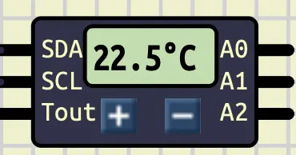

# I2C: part 2

## Introduction

## Temperature: DS1621

> [Link to the Datasheet](https://www.analog.com/media/en/technical-documentation/data-sheets/DS1621.pdf)
>
> [Command Table](https://www.analog.com/media/en/technical-documentation/data-sheets/DS1621.pdf#page=10.84)
>
> [Configuration registers](https://www.analog.com/media/en/technical-documentation/data-sheets/DS1621.pdf#page=5.58)

## Arduino as an I2C Slave

## LCD: Aip31068

## Conclusion
