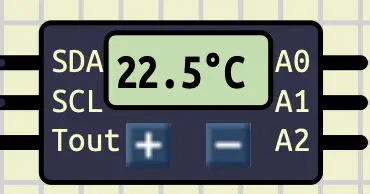
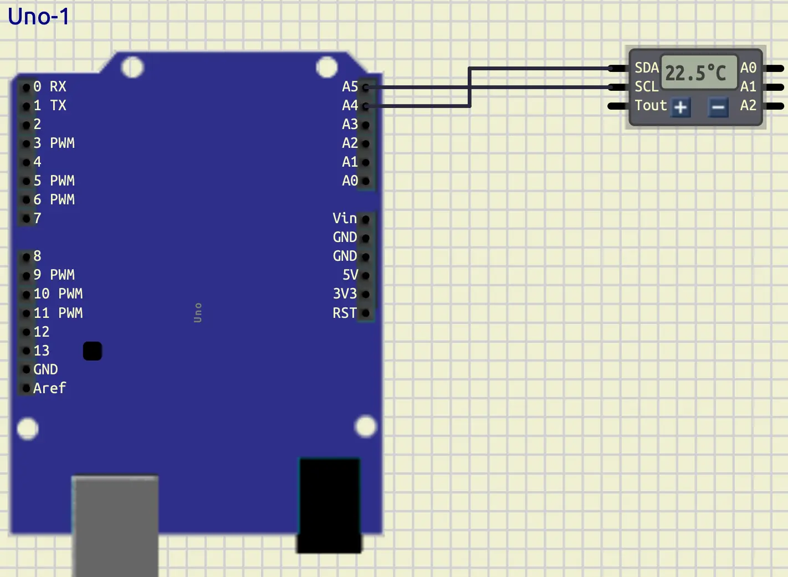
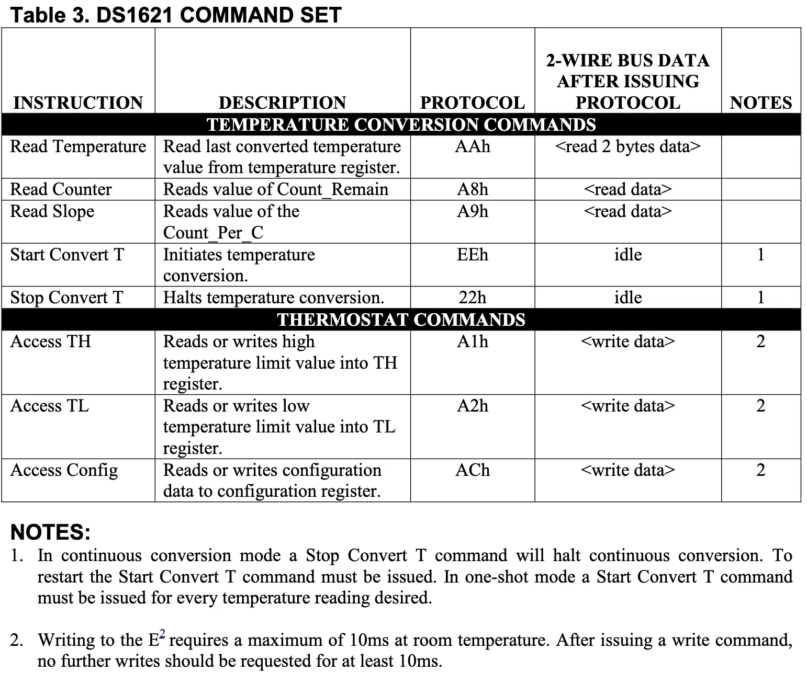
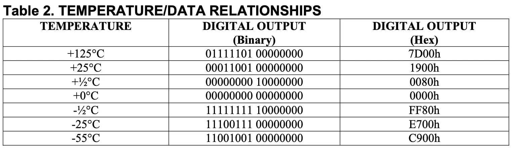
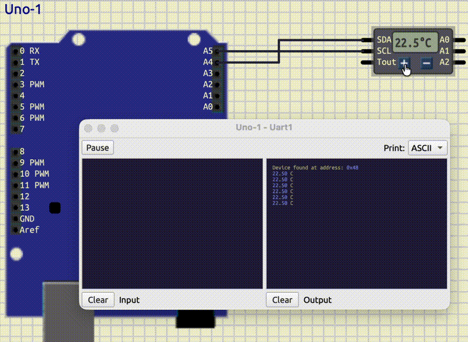
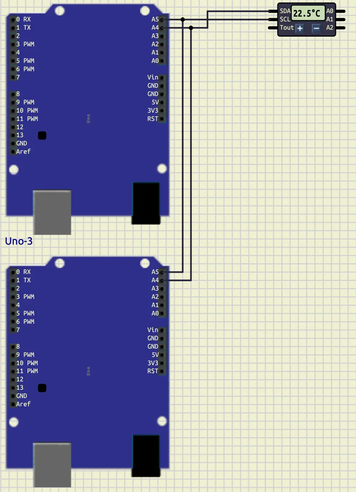
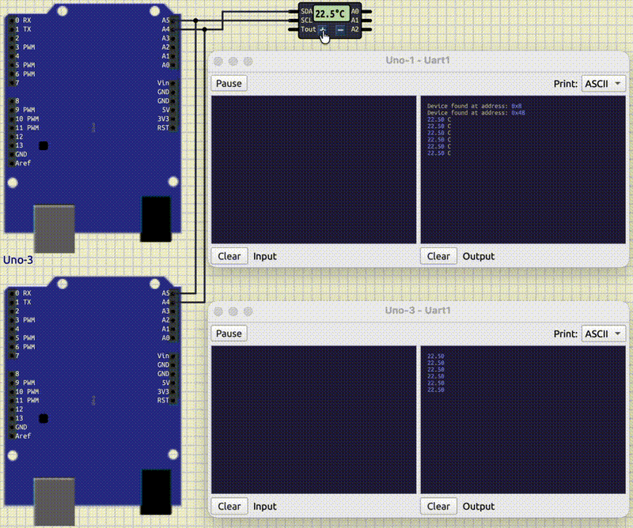
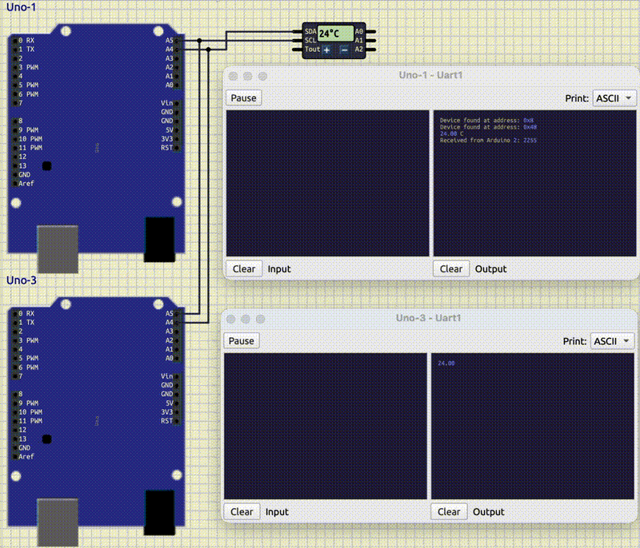

# I2C: part 2

## Introduction

In the previous tutorial, we learned about the **I2C Communication**.
Also, we introduced two components and learned how to communicate with them.
To understand the I2C communication better,
let's work with another component and define an **Arduino** as a **slave**.

## Temperature: DS1621

**DS1621** is a component that measures the temperature.
It can measure temperatures between $[-55C, 125C]$ with the resolution of $0.5$.
It uses I2C communication to report its data.
We can access this component in **SimulIDE** at:
**Micro/Sensors/DS1621**.
Here is how it looks like in **SimulIDE**:



Now, let's connect that to an **Arduino**.
Here how it should look like:



At first, let's find out its id with the scanning code that we wrote
in the previous tutorial.
After running that code, we would get `0x48` as its address.
Let's store it in a definition like below:

```cpp
#define DS1621_ADDRESS 0x48
```

> Advance note: we can change the slave address of this component
> using `A0`, `A1`, and `A2` pins.
> It is useful when we want to connect multiple **DS1621** at once.

Working with **DS1621**, like the other components, has its own standard which
we should apply it in order for it to work.
Let's learn the necessary things that we should do for a successful communication
step by step.
First, let's take a look at its command table below:



In this tutorial, we only need some of its commands to read data
from this component.
At first, we should initialize our conversation.
As you can see in the table, the conversation initialization
is on the *Start Convert T*  row, with the protocol of `EEh`.
So, at the `setup` function we should set that.
Here is the code that we can use.

```cpp
Wire.beginTransmission(DS1621_ADDRESS);
Wire.write(0xEE);
Wire.endTransmission();
```

For the next step, we should take a look at its config register.
You can see that in the figure below.


As you can see, at the lowest bit of its register, there is a
bit called `1SHOT`.
When this bit is set to `1`, it only returns the temperature one time
and closes the conversation.
But, we don't want that to happen.
We want to continuously get data from it.
So, we should set that bit to `0`.
In order to do so, first, we should access config.
As you can see in the command table, its protocol is `ACh`.
Then we are able to change the config in a way that we want.
Here is the code that we can use in our `setup` function:

```cpp
Wire.beginTransmission(DS1621_ADDRESS);
Wire.write(0xAC); // access config
Wire.write(0x00); // put `0` in all the bits of the config register
Wire.endTransmission();
```

As you can see, in the code above, we at first, requested to access the config.
Then we put `0` for all the bits of the config register.
Now, we can make sure that `1SHOT` is set to `0` and the communication
would not be interrupted after one time of reading data.

Now, it's time to learn how the data is being stored in the `DS1621`.
The table below, has explained it using example.
Let's take a look at it.



As you can see, each temperature consists of 2 bytes.
The highest value byte has the integer part of the temperature.
And in the lowest value byte the decimal part is stored.
But they resolution of the **DS1621** is only $0.5$.
So, to show that, they use the highest bit of it.
If it's set to `1` it is equal to $0.5$ and if it has the value of
`0`, it is equal to $0.0$.
With knowing that, let's start writing a function to read the temperature.

```cpp
float read_temperature()
{
  Wire.beginTransmission(DS1621_ADDRESS);
  Wire.write(0xAA);
  Wire.endTransmission();

  Wire.requestFrom(DS1621_ADDRESS, 2);
  byte temp_msb = Wire.read();
  byte temp_lsb = Wire.read();

  float result = temp_msb;
  if (temp_lsb & 0x80)
  {
    result += 0.5;
  }
  return result;
}
```

As you can see, in the function above, at first, we requested that
we want to read the temperature.
If you look at the table, it is in the first row with the protocol of `AAh`.
Then, we should request `2` bytes from the component.
We use the highest value byte as it is.
But for the lowest value byte, we should check if the highest bit is set
to one or not.
If it is set to `1`, then we should add `0.5` to our result.
Now, let's read the temperature every 1 seconds, and display it in the
serial terminal.
Here is the full code:

```cpp
#include <Arduino.h>
#include <Wire.h>

#define DS1621_ADDRESS 0x48

float read_temperature()
{
  Wire.beginTransmission(DS1621_ADDRESS);
  Wire.write(0xAA);
  Wire.endTransmission();

  Wire.requestFrom(DS1621_ADDRESS, 2);
  byte temp_msb = Wire.read();
  byte temp_lsb = Wire.read();

  float result = temp_msb;
  if (temp_lsb & 0x80)
  {
    result += 0.5;
  }
  return result;
}

void setup()
{
  Serial.begin(9600);
  Wire.begin();

  for (int i = 0; i < 128; i++)
  {
    Wire.beginTransmission(i);
    if (Wire.endTransmission() == 0)
    {
      Serial.println("Device found at address: 0x" + String(i, HEX));
    }
  }

  Wire.beginTransmission(DS1621_ADDRESS);
  Wire.write(0xEE);
  Wire.endTransmission();

  Wire.beginTransmission(DS1621_ADDRESS);
  Wire.write(0xAC);
  Wire.write(0x00);
  Wire.endTransmission();

  delay(200);
}

void loop()
{
  float temperature = read_temperature();

  Serial.println(String(temperature) + " C");

  delay(1000);
}
```

Your output should look like below:



As you can see, in the output above, when we change the temperature,
the number displayed in the serial terminal would change accordingly.

> [Link to the Datasheet](https://www.analog.com/media/en/technical-documentation/data-sheets/DS1621.pdf)
>
> [Command Table](https://www.analog.com/media/en/technical-documentation/data-sheets/DS1621.pdf#page=10.84)
>
> [Configuration registers](https://www.analog.com/media/en/technical-documentation/data-sheets/DS1621.pdf#page=5.58)

## Arduino as an I2C Slave

Now, to understand the I2C communication better, let's
learn how to set up an **Arduino** as a slave.
At first, let's connect another **Arduino Uno** to our current setup.
The connection should look like this:



As you can see `A4` is connected to `A4` (SDA) and `A5` (SCL) of the both
are connected together.
Now, it's time to set up our **Arduino** as a slave.
To do so, at first we need a separate project for our second **Arduino**.
Then, we need to set up `Wire` with the address that we want to give that
**Arduino** to be able to call it.
We can do this like below:

```cpp
Wire.begin(8);
```

In the code above, we set the address to `8`.
We should remember that address anytime that we want to call
the second **Arduino**.

As you can recall, we have two modes when we want to start a communication
with a slave.
We can write to a slave, or we can read from it.
Now, let's implement both of the modes, starting from writing to it.

When we write on a slave, that slave should **receive** that data.
To say, what to do when you are receiving data, we should define
a function and pass it to `Wire`.
Here is how we can use it.

```cpp
Wire.onReceive(receiveEvent);
```

On the code above, when we receive a data, a function called `receiveEvent`
would be called.
This calling would work like an `Interrupt`, so we can sure
we don't miss the data when we receive it.
Now, let's implement that function.

```cpp
String result;
bool i2c_ready = false;

void receiveEvent(int howMany)
{
  i2c_ready = true;
  result = "";
  while (Wire.available())
  {
    char c = Wire.read();
    result += c;
  }
}
```

The code above, is one of the ways that we can use to implement that function.
As you can see, we have two global variables called `result` and `i2c_ready`.
`result` stores the data received and `i2c_ready` sets to `true` when there
is data.
For the `receiveEvent` function, we should have an argument.
This argument contains the number of the bytes sent to the slave from the master.
Anytime that this function is called, we set `i2c_ready` to `true` and remove
the previous data.
Then we read all the bytes and add them to `result` until the communication is closed.

Now, let's write the data received in the slave **Arduino** to the serial
terminal in our `loop` function.
Here is the code that can achieve that.

```cpp
if (i2c_ready)
{
  i2c_ready = false;
  Serial.println(result);
}
```

In the code above, we check `i2c_ready` to see if there is any data received or not.
If there was any, we set `i2c_ready` to `false` and print that data.

Now, let's send data from the master **Arduino** to see if we can catch it
in our slave.
To do so, we can use a code like this:

```cpp
#define ARDUINO_2 0x08
```

```cpp
String str_temp = String(temperature);

Wire.beginTransmission(ARDUINO_2);
for (unsigned int i = 0; i < str_temp.length(); i++)
{
  Wire.write(str_temp[i]);
}
Wire.endTransmission();
```

First, we add a definition with the value of `0x08` (Arduino slave address that we set)
called `ARDUINO_2`.
Then, after reading the temperature, we cast it into `String`.
Then we start a transmission with our second **Arduino** and
send all the bytes of that string to it.
And finally we close the transmission.
Here is the output:






## Conclusion
