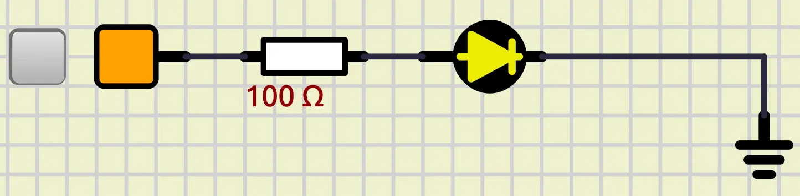

<style scoped>
p {
  color: cyan;
}
</style>

<!-- _header: "" -->
<!-- _footer: "" -->

# Arduino Tutorial

By LiterallyTheOne

## 0: Introduction


---
<!-- paginate: true -->

## Why Arduino?

- Great and easy
- Large supportive community
- Hobbyists
- Industry

---

## Basic examples

- Blink LED project
- Traffic Light controller

---

## Smart Plant Watering system


<!--
<https://projecthub.arduino.cc/lc_lab/automatic-watering-system-for-my-plants-e4c4b9>
-->

---

## Automatic Night Lamp


---

## Distance Measurement


<!-- 
https://projecthub.arduino.cc/ashish80/distance-measuring-device-using-ultrasonic-sensor-8989fb
-->

---

## Robotics


<!--
 https://projecthub.arduino.cc/lee_curiosity/how-to-build-6-dof-robot-arm-from-dfrobot-kit-f14fca 
-->

---

## Home Automation


<!-- 
https://projecthub.arduino.cc/lakshyajhalani56/home-automation-using-arduino-relay-bluetooth-42635c
 -->

---

## Weather station

<!-- 
https://projecthub.arduino.cc/dnbakshi07/mini-weather-station-using-arduino-nano-8bf261
 -->


---

## IoT


<!-- 
https://docs.arduino.cc/arduino-cloud/guides/overview/
 -->

---

## Wearables


---

## What is Arduino?

- Open-source
- Electronic platform
  - Hardware: Uno, Nano, Mega, etc.
  - Software: Arduino IDE
- Best tool to learn electronics

---

## Arduino Uno

- AVR: Atmega328P
- Arduino framework


---

## GPIO

- Digital: 14 (D0-D13)
- Analog: 6 (A0-A5)


---

## Blinking LED

- Hello World
- LED that blinks

---

## Simple LED

- Outputs/Leds/LED
- Sources/Fixed voltage
- Sources/Ground
- Passive/Resistors/Resistor



---

## Connect LED to Arduino Uno


---

## PlatfromIO project


---

<style scoped>
  pre {
    font-size: 20px; /* Adjust this value to your desired size */
  }
</style>

## main.cpp

```cpp
#include <Arduino.h>

// put function declarations here:
int myFunction(int, int);

void setup() {
  // put your setup code here, to run once:
  int result = myFunction(2, 3);
}

void loop() {
  // put your main code here, to run repeatedly:
}

// put function definitions here:
int myFunction(int x, int y) {
  return x + y;
}
```

---

## Remove unnecessary lines

```cpp
#include <Arduino.h>

void setup()
{
}

void loop()
{
}
```

---

## Explaning functions

- `setup`:
  - Initialization
  - Runs one time
- `loop`:
  - Logic
  - While True

---

## Pin Mode

- `pinMode`: Set the mode of a pin
  - `INPUT`
  - `OUTPUT`
- In `setup`

```cpp
pinMode(13, OUTPUT);
```

---

## Blinking

- `digitalWrite`: Write a digital value on a pin
  - `High`
  - `LOW`
- In `loop`

```cpp
digitalWrite(13, HIGH);
delay(500);
digitalWrite(13, LOW);
delay(500);
```

---

## Full code

```cpp
#include <Arduino.h>

void setup()
{
  pinMode(13, OUTPUT);
}

void loop()
{
  digitalWrite(13, HIGH);
  delay(500);
  digitalWrite(13, LOW);
  delay(500);
}
```

---

## Build

- Tick button
  - Top right
  - Bottom left
- `.pio/build/uno/firmware.hex`

---

## Upload firmware

- Right click on **Arduino Uno**
- **mega328**: load firmware
- select the path
- Start simulation

---

## Output


---

## Link to the tutorial and materials


