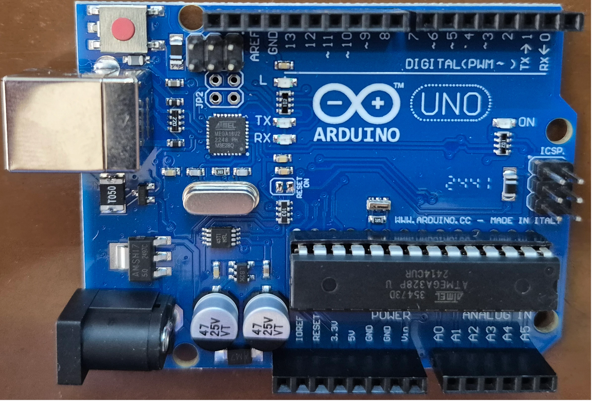

<!-- _header: "" -->
<!-- _footer: "" -->

# Arduino Tutorial

By LiterallyTheOne

---
<!-- paginate: true -->

## About me

- Ramin Zarebidoky
- PhD candidate
- Computer engeneering
- Artificial Intelligence
- Yazd University

---

## Contact me

- Email: <ramin.zarebidoky@stu.yazd.ac.ir>
- Gmail: <ramin.zarebidoky@stu.yazd.ac.ir>
- GitHub: @LiterallyTheOne

---

## About the course

- Arduino Uno
- IDE: PlatformIO
- Simulator: SimulIDE

---

## Material

- <https://literallytheone.github.io/tutorials/arduino/docs/>

---

## Assesment

- For each session:
  - Presence: 0.5
  - Class work: 0.5
- We need 10 sessions = 10 marks
- Extra sessions = Extra marks

---

## Final exam

- Theory: 5
- Practical: 6

---

## Total

- 10 + 5 + 6 = 21
- We might have bonus points in each session
