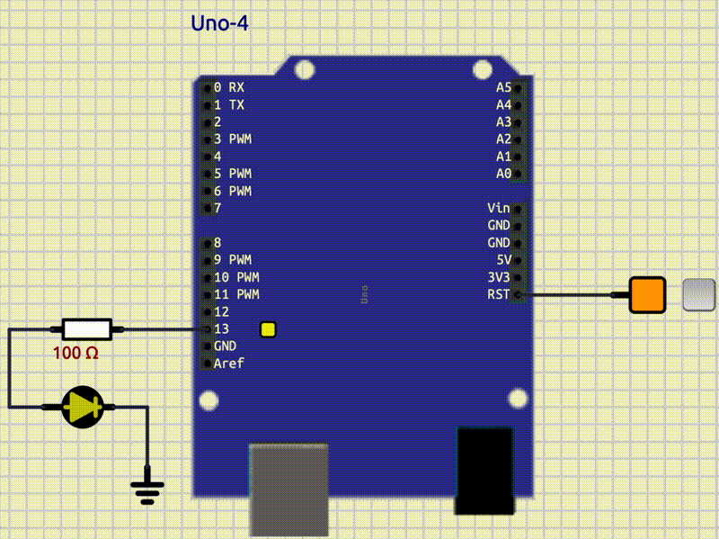

<style scoped>
p {
  color: cyan;
}
</style>

<!-- _header: "" -->
<!-- _footer: "" -->

# Arduino Tutorial

By LiterallyTheOne

## 1: GPIO


---
<!-- paginate: true -->

## Introduction

* Previous tutorial: blinking LED
* This tutorial: GPIO



---

## What is GPIO?

* General Purpose Input/Output
* Input: We read from it
* Output: We write to it

---

## GPIO Pins


* 14 Digital pins:
  * 0-13 (shown in red)
* 6 Analog pins:
  * A0-A5 (shown in yellow)

---

## pinMode

```cpp
pinMode(pin_number, mode);
```

* `pin_number`: number of the pin that we want to change (e.g., 13)
* `mode`: we can choose the mode of the pin; two of the choices are:
* `INPUT`: 0
* `OUTPUT`: 1

---

## pinMode example

* pin 13 as output:

```cpp
pinMode(13, OUTPUT);
```

* pin 3 as input:

```cpp
pinMode(3, INPUT);
```

---

## Add LED and Key


---

## Setup

```cpp
pinMode(13, OUTPUT);
pinMode(2, INPUT);
```

---

## Variables

```cpp
bool led_state = false;
bool button_pressed = false;
```

---

## Logic

```cpp
button_pressed = digitalRead(2);
if (button_pressed)
{
    led_state = !led_state;
    digitalWrite(13, led_state);
    delay(500);
}
```

---

## Full code

<style scoped>
  pre {
    font-size: 18px; /* Adjust this value to your desired size */
  }
</style>

```cpp
#include <Arduino.h>

bool led_state = false;
bool button_pressed = false;

void setup()
{
  pinMode(13, OUTPUT);
  pinMode(2, INPUT);
}

void loop()
{
  button_pressed = digitalRead(2);
  if (button_pressed)
  {
    led_state = !led_state;
    digitalWrite(13, led_state);
    delay(500);
  }
}
```

---

## Result


---

## 3 LEDs


---

## Add another button


---

## Link to the tutorial and materials


