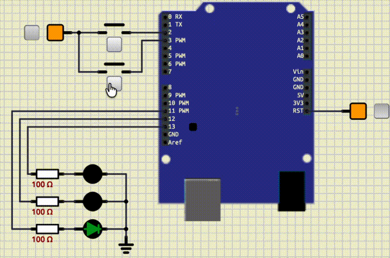
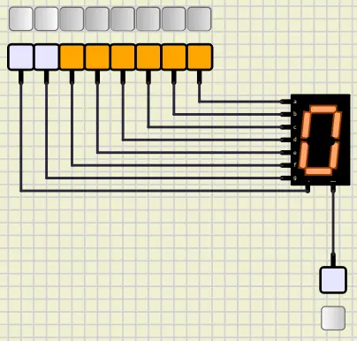

<style scoped>
p {
  color: cyan;
}
</style>

<!-- _header: "" -->
<!-- _footer: "" -->

# Arduino Tutorial

By LiterallyTheOne

## 2: 7-segment


---
<!-- paginate: true -->

## Introduction

* Previous tutorial: GPIO
* This tutorial: 7-segment



---

## What is a 7-segment?

* Set of 7 leds + dp
* Show numbers and letters
* a to g + dp


---

## Connect a 7-segment to fixed voltage


---

## Create a number



---

## Store the number

| dp | g | f | e | d | c | b | a |
|----|---|---|---|---|---|---|---|
| 0  | 0 | 1 | 1 | 1 | 1 | 1 | 1 |

---

## Connect 7-segment to an Arduino


---

## Store our numbers in our code

```cpp
char digits[10] = {
    0b00111111, // 0
    ...
};
```

---

## Show digit function

```cpp
void show_digit(int digit)
{
  for (int i = 0; i < 8; i++)
  {
    digitalWrite(i, (digits[digit] >> i) & 0b0000'0001);
  }
}
```

---

## Counter


---

## Counter with pause


---

## Counter with pause and reverse


---

## Link to the tutorial and materials


