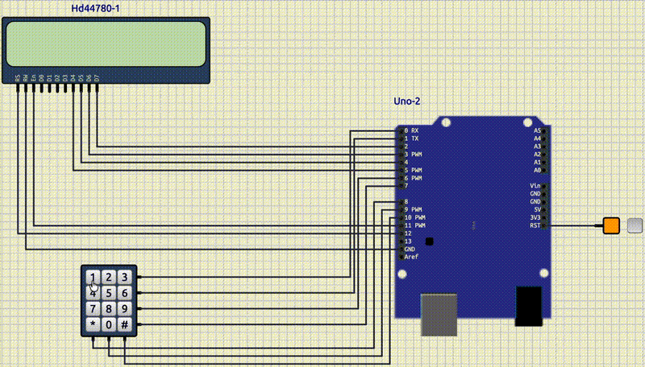

<style scoped>
p {
  color: cyan;
}
</style>

<!-- _header: "" -->
<!-- _footer: "" -->

# Arduino Tutorial

By LiterallyTheOne

## 3: LCD and Keypad


---
<!-- paginate: true -->

## Introduction

* Previous tutorial: 7-segment
* This tutorial: LCD and Keypad


---

## LCD


---

## LCD Arduino SimulIDE

* RS: 12
* RW: ground
* E: 11
* D4: 5
* D6: 4
* D7: 3
* D8: 2


---

## Liquid Crystal

* Well-known package
* Work with LCD

---

## Add Liquid Crystal to PlatformIO

* In `platfromio.ini`

```ini
lib_deps =
  arduino-libraries/LiquidCrystal
```

* in `main.cpp`

```cpp
#include <LiquidCrystal.h>
```

---

## Make an LCD Object

```cpp
const int rs = 12, en = 11, d4 = 5, d5 = 4, d6 = 3, d7 = 2;
LiquidCrystal lcd(rs, en, d4, d5, d6, d7);
```

---

## begin

* initilizes the LCD

```cpp
lcd.begin(cols, rows);
```

* Example:

```cpp
lcd.begin(16, 2);
```

---

## Write

* Write a character

```cpp
lcd.write(ch);
```

* Example:

```cpp
lcd.write('h');
```

---

## Print

* Write a text

```cpp
lcd.print(text);
```

* Example:

```cpp
lcd.print("Hello World!");
```

---

## Set Cursor

* Jumps to the given column and row

```cpp
lcd.setCursor(col, row);
```

* Example:

```cpp
lcd.setCursor(5, 1);
```

---

## Clear

* Clears the LCD and jumps to the start

```cpp
lcd.clear();
```

* Example:

```cpp
lcd.clear();
```

---

## LCD Hello World

* 1st row, 3rd column: "Hello"
* 2nd row, 4th column: "World"


---

## Keypad

* A series of keys
* in a matrix


---

## Connect the Keypad

* row-0: 0
* row-1: 1
* row-2: 6
* row-3: 7
* col-0: 8
* col-1: 9
* col-2: 10


---

## Add Keypad to PlatformIO

* in `platformio.ini`

```ini
lib_deps =
  ...
  Keypad
```

* in `main.cpp`

```cpp
#include <Keypad.h>
```

---

## Define Keys

```cpp
const byte ROWS = 4;
const byte COLS = 3;

char keys[ROWS][COLS] = {
    {'1', '2', '3'},
    {'4', '5', '6'},
    {'7', '8', '9'},
    {'*', '0', '#'}};
```

---

## Define pins

```cpp
byte rowPins[ROWS] = {0, 1, 6, 7};
byte colPins[COLS] = {8, 9, 10};
```

---

## Make a keypad Object

```cpp
Keypad keypad = Keypad(makeKeymap(keys), rowPins, colPins, ROWS, COLS);
```

---

## Get Key

* Gets the pressed key

```cpp
keypad.getKey();
```

* Example:

```cpp
char key = keypad.getKey();
```

---

## Keypad to LCD



---

## Login System

* Correct username: 12
* Correct password: `5662`
* Enter: `#`


---

## Link to the tutorial and materials


