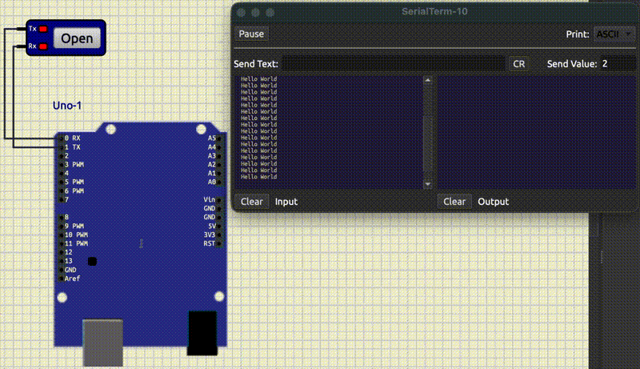
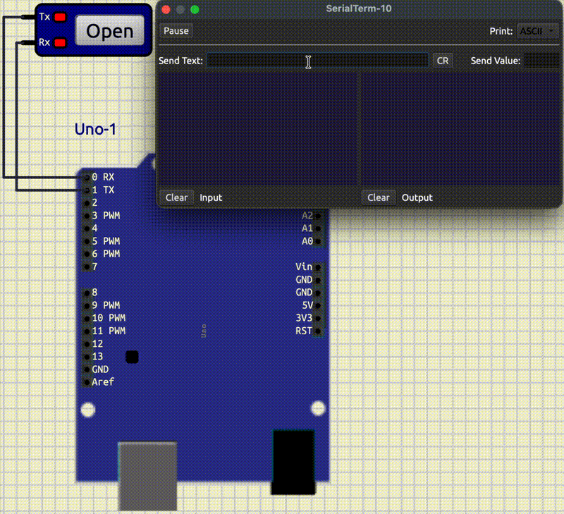
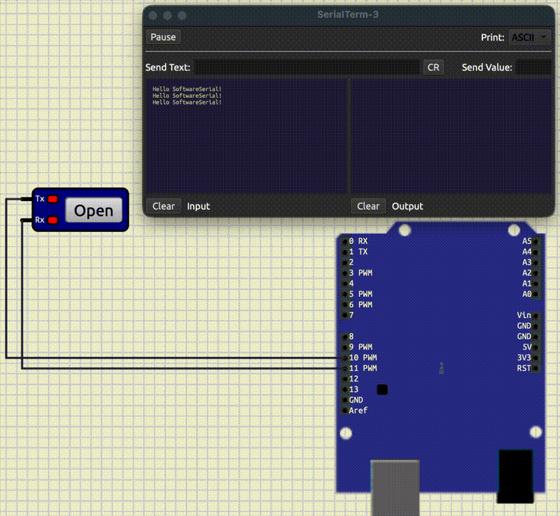
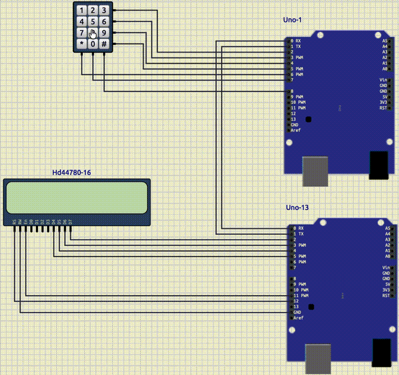

<style scoped>
p {
  color: cyan;
}
</style>

<!-- _header: "" -->
<!-- _footer: "" -->

# Arduino Tutorial

By LiterallyTheOne

## 4: Serial Communication


---
<!-- paginate: true -->

## Introduction

* Previous tutorial: LCD and Keypad
* This tutorial: Serial Communicaion


---

## Serial Communication

* Send
* Recive
* One bit
* One of the most important concept in microcontrollers

---

## Usecase

* Send data to:
  * Computer
  * Microcontroller
  * modules (e.g., Blutooth, GPS)

---

## UART

* Universal Asynchronous Receiver-Transmitter
* The way Arduino handles serial Communication
* Needs two pins:
  * Recieve data (RX)
  * Transmit data (TX)

---

## UART pins in Arduino

* **RX**: **pin 0**
* **TX**: **pin 1**

---

## Baud rate

* Set baud rate correctly to have a communication
* Speed of data transfer
* Asynchronous
* Has a start and end bit

---

## Serial Terminal on SimulIDE

* **TX** of **Arduino** -> **RX** of **Serial Terminal**
* **RX** of **Arduino** -> **TX** of **Serial Terminal**


---

## Serial Hello World

* Set a baud rate and intitialize

```cpp
Serial.begin(9600);
```

* Write on Serial Terminal

```cpp
Serial.println("Hello World");
```

---

## Full code

```cpp
#include <Arduino.h>

void setup()
{
  Serial.begin(9600);
}

void loop()
{
  Serial.println("Hello World");
  delay(1000);
}
```

---

## Output Hello World



---

## Read from Serial Termianl

```cpp
if (Serial.available())
{
    char ch = Serial.read();
    Serial.println(ch);
}
```

---

## Output of reading from terminal


---

## Read until new line

```cpp
if (Serial.available())
{
    String result = Serial.readStringUntil('\n');
    Serial.println(result);
}
```

---

## Output of read until new line



---

## Built-in serial monitor in SimulIDE

* **mega328/Open Serial Monitor/USart**

---

## Software Serial

* Hardware serial communication:
  * 0
  * 1
* If we want to use other pins for serial communication
  * We use Software Serial

---

## Software Serial usage

* Include

```cpp
#include <SoftwareSerial.h>
```

* Make a serial object

```cpp
SoftwareSerial mySerial(10, 11); // RX, TX
```

---

## Full code Software Serial

```cpp
#include <Arduino.h>
#include <SoftwareSerial.h>

SoftwareSerial mySerial(10, 11); // RX, TX

void setup()
{
  mySerial.begin(9600);
}

void loop()
{
  mySerial.println("Hello SoftwareSerial!");
  delay(1000);
}
```

---

## Output of Software Serial



---

## Two Arduinos



---

## Link to the tutorial and materials


