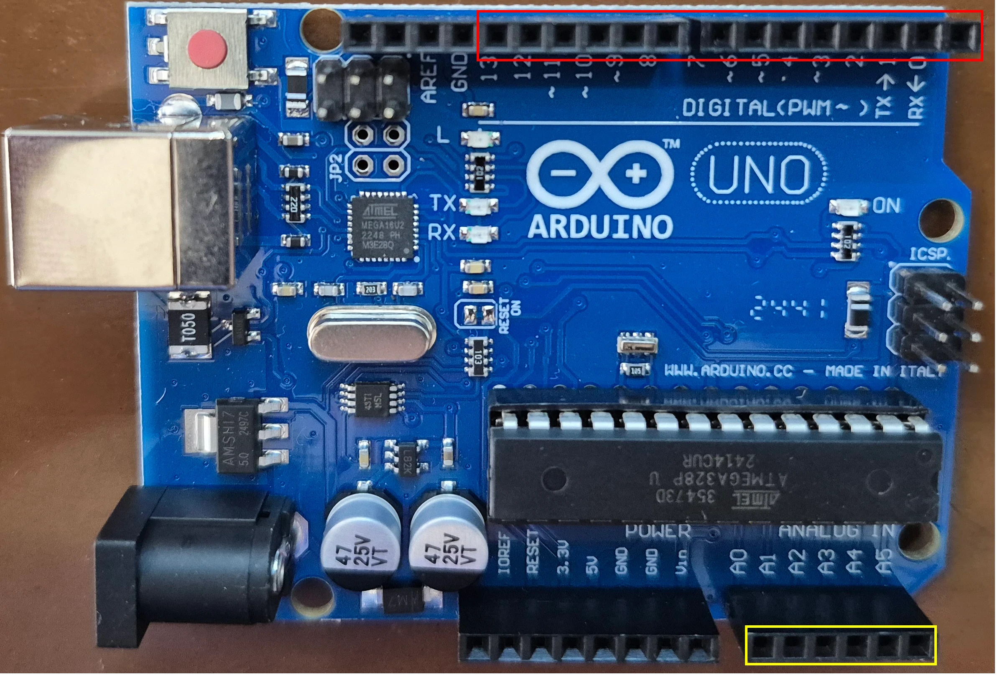

<style scoped>
p {
  color: cyan;
}
</style>

<!-- _header: "" -->
<!-- _footer: "" -->

# Arduino Tutorial

By LiterallyTheOne

## 5: Analog


---
<!-- paginate: true -->

## Introduction

* Previous tutorial: Serial Communication
* This tutorial: Analog


---

## Analog Read

* `digitalRead`
  * $5V = 1$
  * $0V = 0$
* `analogRead` (`10bit`)
  * $5V = 1023$
  * $0V = 0$

---

## Analog pins

* 6 pins: A0 to A5
* Showed by yellow



---

## Potentiomenter

* Creates voltage between $0V$ and $5V$
* In **SimulIDE**: **Passive/Resistors/Potentiometer**
* $3$ pins and a rotating button

---

## Connect potentiometer


---

## Potentiomenter and Arduino


---

## Write the code for analogRead

```cpp
#include <Arduino.h>

void setup()
{
  Serial.begin(9600);
}

void loop()
{
  int our_input = analogRead(A0);
  Serial.println(String(our_input));
  delay(1000);
}
```

---

## Result of analogRead


---

## PWM

* Pulse Width Modulation
* Technique for controlling the power
* Arduino uses it for writing analog values

---

## PWM duty cycle


---

## Analog Write pins

* Uses **PWM**
* There are 6 pins: 3, 5, 6, 9, 10, 11
* In arduino: **~**
* In SimulIDE: **PWM**

---

## Analog Write

* `digitalWrite`:
  * $0$
  * $1$
* `analogWrite`:
  * $255 = 100\%$ duty cycle
  * $0 = 0\%$ duty cycle

---

## Conect LED


---

## Write code for analog write

<style scoped>
  pre {
    font-size: 25px; /* Adjust this value to your desired size */
  }
</style>

```cpp
#include <Arduino.h>

void setup()
{
  pinMode(3, OUTPUT);
}

void loop()
{
  for (int i = 0; i < 256; i++)
  {
    analogWrite(3, i);
    delay(10);
  }
}
```

---

## Result of analogWrite


---

## See PWM with Oscope


---

## Combining both


---

## Write the code for combining both

<style scoped>
  pre {
    font-size: 23px; /* Adjust this value to your desired size */
  }
</style>

```cpp
#include <Arduino.h>

void setup()
{
  pinMode(3, OUTPUT);
}

void loop()
{
  int our_input = analogRead(A0);
  int brightness = map(our_input, 0, 1023, 0, 255);
  analogWrite(3, brightness);
  delay(1000);
}
```

---

## map function

* maps our input to the range that we want
* first argument: input
* second and third: input's range
* forth and fifth: output's range

---

## Result of combining both


---

## Result of combining both with Oscope


---

## DC Motor

* Converts electrical energy into rotation
* Examples:
  * Drill
  * Saw
  * Toys

---

## mosfet

* DC motor takes to much current
* Should not be connected directly to Arduino pin
* We use mosfet to write analog data

---

## Connect DC Motor to Arduino


---

## Result of DC motor

* Code is the same


---

## Servo motor

* Precise control
* Robotics
* Position motor with **PWM**
* Simple DC Servo motor
* [-90, 90] ([0, 180])
* frequency: $50hz$

---

## Connect Servo motor to Arduino


---

## Servo library

* Generates $50hz$ frequency
* in **PlatformIO**:

```ini
lib_deps =
    ...
    arduino-libraries/Servo
```

* in main.cpp:

```cpp
#include <Servo.h>
```

---

## Servo functions

* Create an object

```cpp
Servo my_servo;
```

* identify the pin

```cpp
my_servo.attach(3);
```

* Write angle

```cpp
my_servo.write(45);
```

---

## Result of Servo motor


---

## Result of Servo motor with Oscope


---

## Combine All


---

## Link to the tutorial and materials


