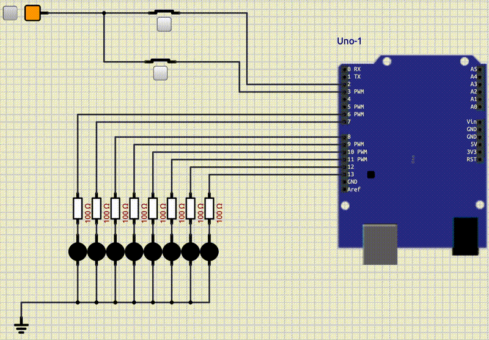

<style scoped>
p {
  color: cyan;
}
</style>

<!-- _header: "" -->
<!-- _footer: "" -->

# Arduino Tutorial

By LiterallyTheOne

## 6: Interrupt


---
<!-- paginate: true -->

## Introduction

* Previous tutorial: Analog
* This tutorial: Interrupt


---

## External Interrupt

* Special Signal
* Pause the current action
* Run a code in a function
* Interrupt Service Routine Function (ISR Function)

---

## External Interrupt in Arduino Uno

* 2 External Interrupts
* pin 2, 3

---

## Setup LEDs


---

## Write a Routine

<style scoped>
  pre {
    font-size: 17px; /* Adjust this value to your desired size */
  }
</style>

```cpp
#include <Arduino.h>

int led_pins[8] = {6, 7, 8, 9, 10, 11, 12, 13};

int current_led = 0;

void setup()
{
  for (int i = 0; i < 8; i++)
  {
    pinMode(led_pins[i], OUTPUT);
  }
}

void loop()
{
  digitalWrite(led_pins[current_led], HIGH);
  delay(200);
  digitalWrite(led_pins[current_led], LOW);

  current_led++;
  current_led %= 8;
}
```

---

## Output of LED setup


---

## Connect an Interrupt

* Button is **Normally Closed**
* Default: 5V
* Change: 0V


---

## Define Interrupt in Arduino

* `attachInterrupt`
  * pin
  * **ISR** function
  * mode

---

## Define Interrupt pin

* `digitalPinToInterrupt`

```cpp
attachInterrupt(digitalPinToInterrupt(2), ... ,...);
```

---

## Define ISR function

```cpp
void isr_pause()
{
}
```

```cpp
attachInterrupt(digitalPinToInterrupt(2), isr_pause ,...);
```

---

## Modes

<style scoped>
  {
    font-size: 30px; /* Adjust this value to your desired size */
  }
</style>

| Mode    | Description                                           | figure                                                  |
|---------|-------------------------------------------------------|---------------------------------------------------------|
| LOW     | trigger the interrupt whenever the pin is low.        |        |
| CHANGE  | trigger the interrupt whenever the pin changes value. |  |
| RISING  | trigger when the pin goes from low to high.           |      |
| FALLING | trigger when the pin goes from high to low.           |      |

---

## Add mode

```cpp
attachInterrupt(digitalPinToInterrupt(2), isr_pause, RISING);
```

---

## Fill the isr function

<style scoped>
  pre {
    font-size: 13px; /* Adjust this value to your desired size */
  }
</style>

```cpp
#include <Arduino.h>

int led_pins[8] = {6, 7, 8, 9, 10, 11, 12, 13};

int current_led = 0;
int x = 1;

void isr_pause()
{
  x = 1 - x;
}

void setup()
{
  for (int i = 0; i < 8; i++)
  {
    pinMode(led_pins[i], OUTPUT);
  }

  attachInterrupt(digitalPinToInterrupt(2), isr_pause, RISING);
}

void loop()
{
  digitalWrite(led_pins[current_led], HIGH);
  delay(200);
  digitalWrite(led_pins[current_led], LOW);

  current_led += x;
  current_led %= 8;
}
```

---

## Output of pause interrupt


---

## Volatile in Cpp

* Stops Compiler optimazation for a variable

```cpp
volatile int v;
```

---

## Reset with Interrupt


---

## Increment pattern


---

## LEDS dance



---

## Link to the tutorial and materials


