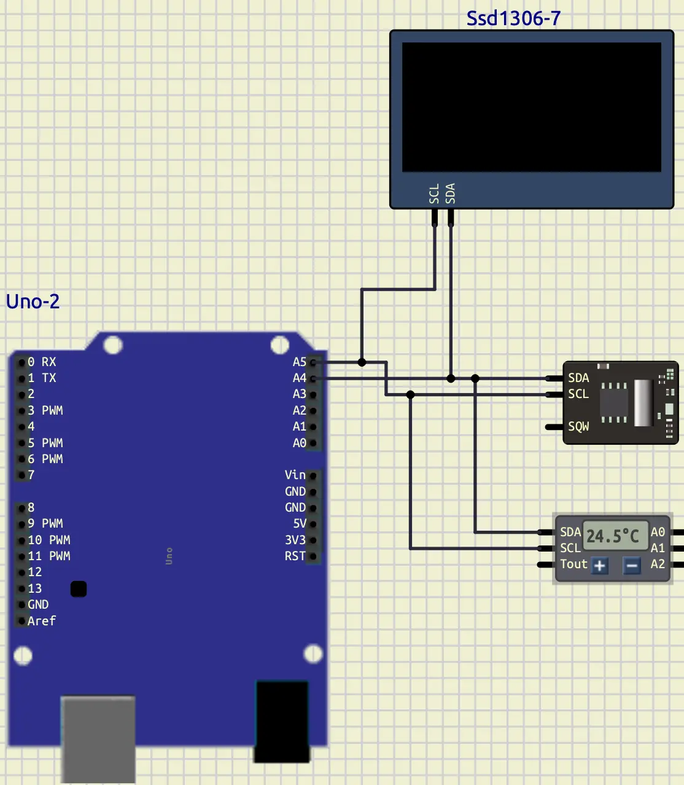
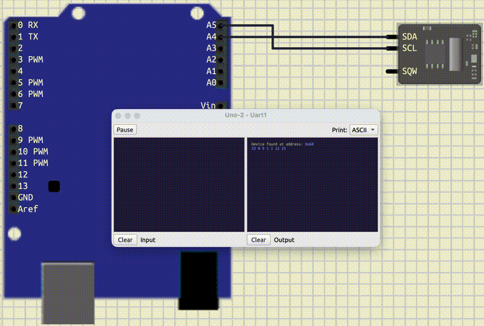
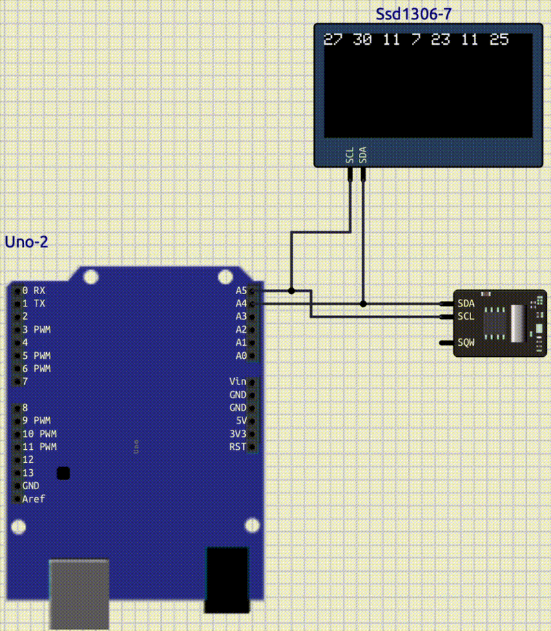

<style scoped>
p {
  color: cyan;
}
</style>

<!-- _header: "" -->
<!-- _footer: "" -->

# Arduino Tutorial

By LiterallyTheOne

## 7: I2C: Part 1


---
<!-- paginate: true -->

## Introduction

* Previous tutorial: Interrupt
* This tutorial: I2C


---

## I2C Communication

* Inter-Integrated Circuit
* 2 Wire
* Short-distance

---

## I2C Pins

* **SDA**: Serial Data
* **SCL**: Serial Clock

---

## Master and Slave

* **Master**: 1
* **Slave**: multiple
* We can connect multiple components to the same pins

---

## Master's privileges

* Controls the clock on **SCL**
* Decides that if it wants to communicate with **slaves**

---

## Communication structure

<style scoped>
  {
    font-size: 20px; /* Adjust this value to your desired size */
  }
</style>

| Field         | Bit Count | Description                                                         |
|---------------|-----------|---------------------------------------------------------------------|
| START         | —         | SDA goes LOW while SCL is HIGH → begins communication               |
| Slave Address | 7 bits    | Unique address of target device (0–127)                             |
| R/W Bit       | 1 bit     | 0 = Write, 1 = Read                                                 |
| ACK/NACK      | 1 bit     | Receiver pulls SDA LOW to acknowledge (ACK), HIGH for no-ack (NACK) |
| Data Byte 1   | 8 bits    | First byte of data to write or read                                 |
| ACK/NACK      | 1 bit     | Receiver acknowledges the byte                                      |
| Data Byte 2…N | 8 bits    | Additional data bytes (optional, depends on protocol)               |
| ACK/NACK      | 1 bit     | Acknowledge after each data byte                                    |
| STOP          | —         | SDA goes HIGH while SCL is HIGH → ends communication                |

---

## I2C pins in Arduino Uno

| signal  | pin  |
|---------|------|
| **SDA** | `A4` |
| **SCL** | `A5` |

---

## Wire

* Library to control **I2C Communication** in **Arduino**
* Include `Wire`:

```cpp
#include <Wire.h>
```

* Initilize `Wire`:

```cpp
Wire.begin();
```

---

## Different communication with an slave

* Read
* Write

---

## Write

```cpp
// start the communication in order to write
// with the slave with the address of `addr`
Wire.beginTransmission(addr);   
Wire.write(data);               // write data
Wire.endTransmission();         // finish transmission
```

---

## Read

```cpp
// start a read communication with the slave
// with the address of `addr` and read `number` bytes
Wire.requestFrom(addr, number);
Wire.read();                    // read bytes
```

---

## Connect a Clock to an Arduino

* **DS1307**: **Micro/Peripherals/DS1307**


---

## Code to scan

<style scoped>
  {
    font-size: 28px;
  }
</style>

```cpp
#include <Arduino.h>
#include <Wire.h>

void setup()
{
  Wire.begin();
  Serial.begin(9600);
}

void loop()
{
  for (int i = 0; i < 127; i++)
  {
    Wire.beginTransmission(i);
    if (Wire.endTransmission() == 0)
    {
      Serial.println("Device found at address: 0x" + String(i, HEX));
    }
  }
  delay(2000);
}
```

---

## Connect OLED

* **SSD1306**: **Outputs/Displays/SSD1306**


---

## Connect Temperature

* **DS1621**: **Micro/Sensors/DS1621**



---

## Clock: DS1307

* Real-Time Clock (RTC) integrated circuit
* keeps track of the current time and date
* Battery

---

<style scoped>
  {
    font-size: 30px;
  }
</style>

## DS1307 registers

| Register     | Address |
|--------------|---------|
| Seconds      | 0x00    |
| Minutes      | 0x01    |
| Hours        | 0x02    |
| Day of Week  | 0x03    |
| Day of Month | 0x04    |
| Month        | 0x05    |
| Year         | 0x06    |

---

## Way that it stores data

* Storing: 0x22 -> 22
* Not 2*16+2

---

## DS1307: Define global variables

```cpp
#define DS1307_ADDRESS 0x68

#define TIME_READ 7

// seconds, minutes, hours, weekday, day, month, year
byte time[TIME_READ];
```

---

## DS1307: Function to read

```cpp
void read_date_and_time()
{
  Wire.beginTransmission(DS1307_ADDRESS);
  Wire.write(0x00);
  Wire.endTransmission();

  Wire.requestFrom(DS1307_ADDRESS, 7);

  for (int i = 0; i < TIME_READ; i++)
  {
    time[i] = Wire.read();
  }
}
```

---

## DS1307: Display in Serial

```cpp
for (int i = 0; i < TIME_READ; i++)
{
  int time_int = 0;
  time_int = (time[i] / 16) * 10 + time[i] % 16;
  Serial.print(String(time_int) + " ");
}
Serial.println();
```

---

## DS1307: Read output



---

## DS1307: Write

```cpp
void write_date_and_time(int *time_to_write)
{
  Wire.beginTransmission(DS1307_ADDRESS);
  Wire.write(0x00);

  for (int i = 0; i < TIME_READ; i++)
  {
    byte time_byte = (time_to_write[i] / 10) * 16 + time_to_write[i] % 10;
    Wire.write(time_byte);
  }
  Wire.endTransmission();
}
```

---

## DS1307: Example

```cpp
int time_to_write[7] = {
    20, // second
    30, // minute
    11, // hour
    7,  // day of the week
    23, // day of the month
    11, // month
    25, // year
};
write_date_and_time(time_to_write);
```

---

## DS1307: Write output


---

## OLED: SSD1306

* OLED (Organic Light Emitting Diode)
* Graphic display modules

---

## AdaFruit

* Library to control graphics
* Add to platfomIO

```ini
lib_deps =
    Adafruit SSD1306
    Adafruit GFX Library
```

* Include

```cpp
#include <Adafruit_GFX.h>
#include <Adafruit_SSD1306.h>
```

---

## SSD1306: global variables

```cpp
#define SCREEN_WIDTH 128
#define SCREEN_HEIGHT 64

Adafruit_SSD1306 display(SCREEN_WIDTH, SCREEN_HEIGHT, &Wire);
```

---

## SSD1306: setup

```cpp
if (!display.begin(SSD1306_SWITCHCAPVCC, SSD1306_ADDRESS))
{
Serial.println("SSD1306 failed!");
for (;;)
  ;
}

display.setTextSize(1);
display.setTextColor(WHITE, BLACK);
```

---

## SSD1306: display

```cpp
display.clearDisplay();
display.setCursor(0, 0);
```

```cpp
display.print("Hello World!");
display.display();
```

---

## SSD1306: Show the clock



---

## OLED ball


---

## OLED ball line


---

## Link to the tutorial and materials


