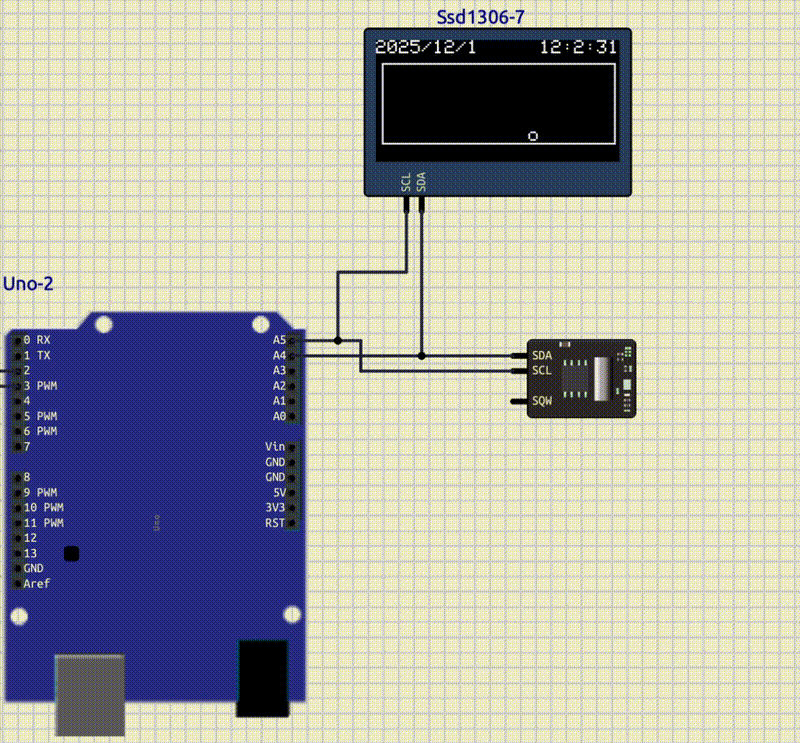
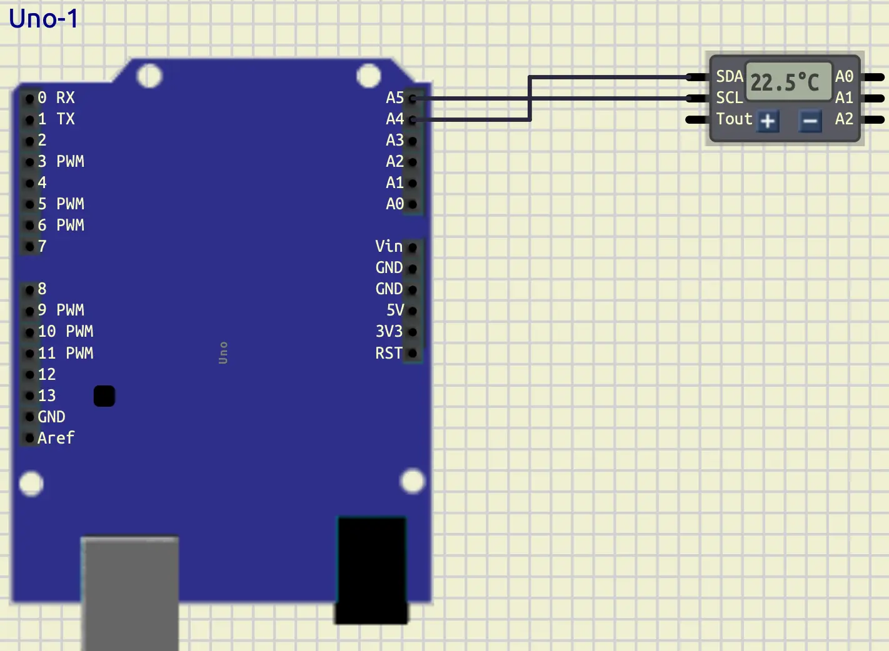
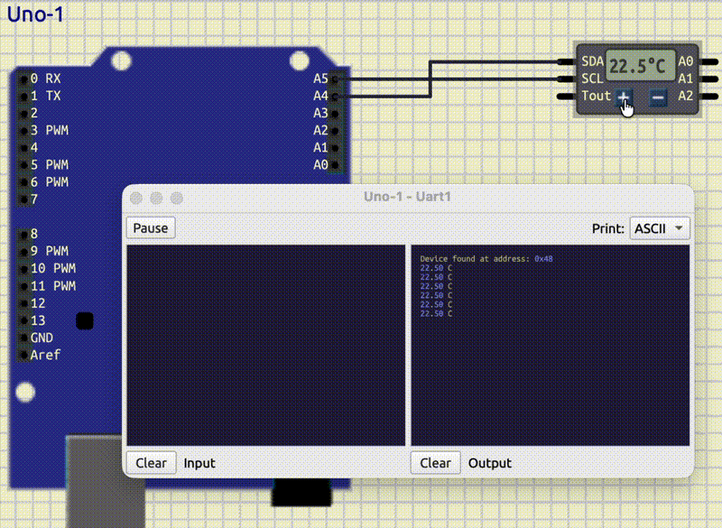
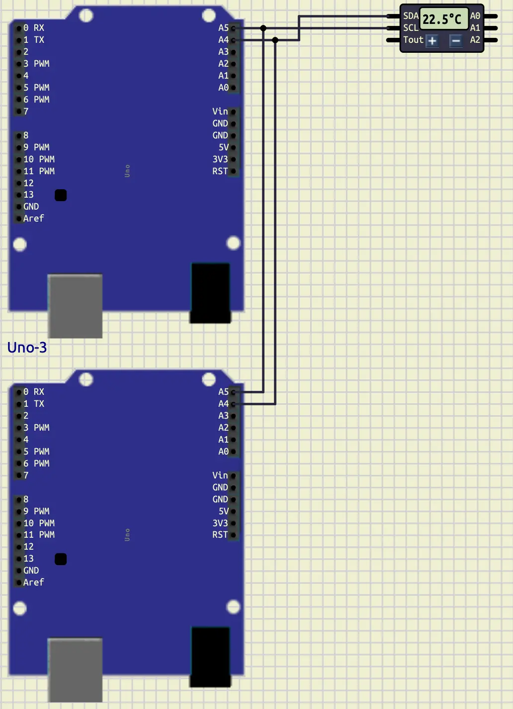
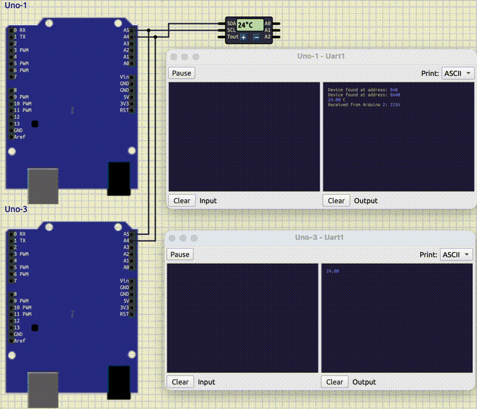

<style scoped>
p {
  color: cyan;
}
</style>

<!-- _header: "" -->
<!-- _footer: "" -->

# Arduino Tutorial

By LiterallyTheOne

## 8: I2C: Part 2


---
<!-- paginate: true -->

## Introduction

* Previous tutorial: I2C part 1
* This tutorial: I2C part 2



---

## DS1621

* Measures Temperature
  * $[-55C, 125C]$
  * $0.5$ resolution
* I2C


---

## DS1621: Connect to Arduino

* **DS1621**: **Micro/Sensors/DS1621**



---

## DS1621: Find the ID

* With the scan code

```cpp
#define DS1621_ADDRESS 0x48
```

---

## DS1621: Command table


---

## DS1621: Initiate conversation

```cpp
Wire.beginTransmission(DS1621_ADDRESS);
Wire.write(0xEE);
Wire.endTransmission();
```

---

## DS1621: Remove 1shot


```cpp
Wire.beginTransmission(DS1621_ADDRESS);
Wire.write(0xAC);
Wire.write(0x00);
Wire.endTransmission();
```

---

## DS1621: Request Read

```cpp
Wire.beginTransmission(DS1621_ADDRESS);
Wire.write(0xAA);
Wire.endTransmission();
```

---

## DS1621: Read 2 bytes

```cpp
Wire.requestFrom(DS1621_ADDRESS, 2);
byte temp_msb = Wire.read();
byte temp_lsb = Wire.read();
```

---

## DS1621: Storage method


---

## DS1621: Convert those two bytes

```cpp
float result = temp_msb;
if (temp_lsb & 0x80)
{
  result += 0.5;
}
```

---

## DS1621: result



---

## Arduino slave

* We can configure an Arduino as a slave

---

## Connect the second Arduino



---

## Initialize the second Arduino

```cpp
Wire.begin(8);
```

## OnReceive

* Works as an interrupt

```cpp
Wire.onReceive(receiveEvent);
```

---

## Get all the data and set a flag

```cpp
String result;
bool i2c_ready = false;

void receiveEvent(int howMany)
{
  i2c_ready = true;
  result = "";
  while (Wire.available())
  {
    char c = Wire.read();
    result += c;
  }
}
```

---

## Write the data in the Serial Terminal

```cpp
if (i2c_ready)
{
  i2c_ready = false;
  Serial.println(result);
}
```

---

## Send data from Master

```cpp
#define ARDUINO_2 0x08
```

```cpp
String str_temp = String(temperature);

Wire.beginTransmission(ARDUINO_2);
for (unsigned int i = 0; i < str_temp.length(); i++)
{
  Wire.write(str_temp[i]);
}
Wire.endTransmission();
```

---

## Output of 2 Arduinos


---

## OnRequest

* Triggers when a request happens

```cpp
Wire.onRequest(requestEvent);
```

---

## Write two bytes

```cpp
void requestEvent()
{
    Wire.write(5);
    Wire.write(6);
}
```

---

## Receive data from Master

```cpp
Wire.requestFrom(ARDUINO_2, 2);
String received_data = "";
received_data += Wire.read();
received_data += Wire.read();
```

---

## Small detail about Wire

* `onReceive` gets triggered on both
  * Getting data
  * Sending data
* At the beginning of the function

```cpp
if (howMany == 0)
    return;
```

---

## Output of receiving and sending



---

## Link to the tutorial and materials


